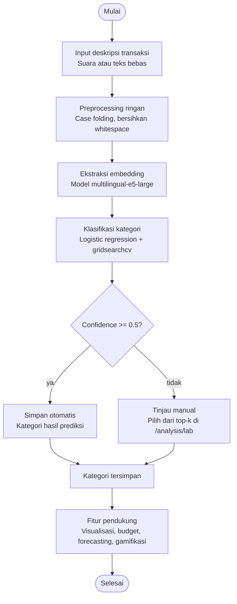

# RANCANG BANGUN APLIKASI WEB MANAJEMEN KEUANGAN PRIBADI DENGAN ANALISIS POLA PENGELUARAN MENGGUNAKAN SENTENCE-BERT DAN LOGISTIC REGRESSION

**Oleh:** Pito Desri Pauzi (2211083044)
Program Studi Sarjana Terapan Teknologi Rekayasa Perangkat Lunak
Jurusan Teknologi Informasi — Politeknik Negeri Padang

---

## ABSTRAK

Aplikasi manajemen keuangan pribadi yang ada saat ini umumnya memerlukan pengguna untuk melakukan kategorisasi transaksi secara manual, sebuah proses yang repetitif dan seringkali tidak konsisten. Hal ini menyebabkan data keuangan pengguna kurang terstruktur sehingga wawasan yang didapat menjadi terbatas. Proyek Akhir ini merancang dan membangun aplikasi web manajemen keuangan pribadi bernama Fintrack yang mampu melakukan kategorisasi transaksi secara otomatis dari teks deskripsi bebas pengguna.

Metode inti yang digunakan adalah kombinasi Sentence-BERT (menggunakan model Multilingual-E5-Large dari keluarga Sentence Transformer) untuk menghasilkan representasi vektor semantik dari deskripsi transaksi, dan Logistic Regression sebagai algoritma klasifikasi supervised untuk memprediksi kategori transaksi berdasarkan dataset transaksi berlabel. Parameter optimal model (kekuatan regularisasi C dan jenis solver) ditentukan secara otomatis melalui GridSearchCV dengan validasi silang berbasis metrik F1-macro, sehingga model yang dihasilkan tervalidasi secara kuantitatif sebelum digunakan. Setiap hasil prediksi dilengkapi dengan skor kepercayaan (confidence score) berupa probabilitas keluaran fungsi softmax, beserta kandidat kategori alternatif (top-k) untuk mendukung verifikasi pengguna pada kasus dengan keyakinan rendah.

Selain modul kategorisasi, sistem dilengkapi fitur pendukung meliputi budget goals, notifikasi dan reminder berbasis Web Push API, forecasting pengeluaran berbasis Simple Moving Average (SMA), ekspor laporan PDF dan Excel, riwayat log aktivitas, serta gamifikasi (XP, badge, streak, challenge). Sistem dibangun menggunakan arsitektur microservice: frontend Next.js (Progressive Web App), backend Node.js dengan Express.js dan Prisma ORM, layanan ML FastAPI (Python), dan database PostgreSQL. Model dilatih pada dataset sebanyak 6.930 baris data bersih yang mencakup 41 kategori pengeluaran, menghasilkan akurasi sebesar 86,94% dan F1-score rata-rata tertimbang sebesar 0,87 pada data uji.

**Kata Kunci:** Manajemen Keuangan Pribadi, Sentence-BERT, Logistic Regression, GridSearchCV, Progressive Web App, Supervised Learning.

---

# BAB I PENDAHULUAN

## 1.1 Latar Belakang

Mengelola keuangan pribadi itu penting, tapi banyak orang masih jarang mencatat pengeluarannya secara rutin. Salah satu penyebabnya bukan karena malas, tapi karena proses pencatatan di aplikasi keuangan biasanya cukup ribet: pengguna harus pilih kategori satu per satu, isi nominal, baru simpan. Kalau dilakukan berkali-kali setiap hari, langkah-langkah ini jadi terasa melelahkan sehingga banyak orang akhirnya berhenti mencatat.

Proyek Akhir ini mencoba pendekatan lain lewat Fintrack, aplikasi manajemen keuangan pribadi berbasis Progressive Web App (PWA) yang menggunakan input suara sebagai cara utama mencatat transaksi. Idenya sederhana: semakin sedikit langkah yang harus dilakukan pengguna, semakin besar kemungkinan mereka mau mencatat transaksinya secara rutin.

Menggunakan input suara juga punya tantangan tersendiri, terutama saat sistem harus memahami maksud dari kalimat yang diucapkan pengguna. Cara orang menyebutkan transaksi bisa sangat beragam, misalnya "beli kopi dua puluh ribu", "jajan siang", atau "transfer ke rekening BCA". Sistem tidak bisa hanya mengandalkan pencocokan kata kunci untuk memahami kalimat-kalimat seperti ini, karena itu Fintrack menggunakan model `multilingual-e5-large` untuk mengubah teks menjadi representasi vektor yang menangkap makna kalimat, bukan sekadar kata per kata.

Setelah teks diubah jadi vektor, kategorinya ditentukan menggunakan model Logistic Regression yang dilatih dari 6.930 data transaksi berlabel yang tersebar di 41 kategori pengeluaran. Parameter model (kekuatan regularisasi C dan jenis solver) dicari otomatis memakai GridSearchCV, jadi tidak perlu diatur manual satu per satu. Pendekatan ini dipilih karena performanya bisa diukur dengan jelas sebelum aplikasi dipakai (akurasi 86,94% pada data uji), berbeda dengan pendekatan lain yang hasilnya lebih sulit diukur secara langsung. Proses klasifikasi juga berjalan cepat karena model hanya perlu sekali menghitung embedding dan sekali evaluasi, sehingga hasil prediksi bisa langsung muncul tanpa jeda lama. Untuk tugas lain yang lebih berat tapi tidak perlu langsung terlihat hasilnya, seperti update XP dan streak gamifikasi atau kirim notifikasi terjadwal, sistem memprosesnya di belakang layar memakai Bull Queue dan Redis, supaya tidak membuat aplikasi terasa lambat saat dipakai.

Fintrack juga dibangun sebagai PWA supaya bisa diinstal langsung dari browser ke perangkat pengguna, tanpa perlu lewat app store. Data transaksi disimpan sementara di perangkat lewat IndexedDB, lalu disinkronkan otomatis ke server begitu koneksi internet tersedia lagi, sehingga aplikasi tetap bisa dipakai walau sinyal sedang lemah atau terputus sepenuhnya.

## 1.2 Rumusan Masalah

Dari latar belakang di atas, ada beberapa pertanyaan yang jadi fokus pengembangan Fintrack:

1. Bagaimana membuat fitur input suara yang mudah dan cepat digunakan, sehingga pengguna lebih konsisten mencatat transaksi setiap hari?
2. Bagaimana caranya sistem bisa mengenali kategori transaksi dengan tepat dari teks bahasa Indonesia yang ditulis bebas dan bervariasi gayanya?
3. Bagaimana proses embedding dan klasifikasi ML bisa dijalankan tanpa membuat aplikasi terasa lambat saat digunakan?
4. Bagaimana memastikan pengguna tetap bisa mencatat transaksi walaupun koneksi internet terbatas atau sedang terputus?

## 1.3 Tujuan Proyek Akhir

Tujuan yang ingin dicapai dari pelaksanaan Proyek Akhir ini adalah:

1. Menghasilkan modul pemrosesan bahasa alami yang mampu mengekstrak nilai semantik dari deskripsi transaksi keuangan menggunakan model Multilingual-E5-Large.
2. Mengembangkan model klasifikasi otomatis (automated classification) berbasis Logistic Regression yang akurat dalam mengenali kategori transaksi dari variasi pencatatan keuangan pribadi pengguna.
3. Mengimplementasikan mekanisme pencarian hyperparameter optimal (kekuatan regularisasi C dan jenis solver) secara otomatis menggunakan GridSearchCV dengan validasi silang berbasis metrik F1-macro.
4. Membangun fungsionalitas kendali kualitas (quality control) bagi pengguna berupa halaman `/analysis/lab` yang menampilkan daftar transaksi dengan prediksi berkeyakinan rendah, dipicu secara otomatis apabila confidence score hasil `predict_proba()` model klasifikasi berada di bawah ambang batas 0.5, sehingga pengguna dapat meninjau dan menetapkan kategori yang tepat secara manual.
5. Merealisasikan sistem antrian asinkron yang andal dengan Bull Queue dan Redis guna memproses tugas-tugas di balik layar seperti pembaruan streak, level, dan XP secara efisien.
6. Mewujudkan aplikasi web Fintrack dengan standarisasi PWA yang responsif, mendukung operasi tanpa jaringan (offline logging), serta memiliki visualisasi analisis finansial yang lengkap.

## 1.4 Manfaat

Manfaat dari pembuatan aplikasi Fintrack ini antara lain:

1. **Bagi Pengguna:** Pengguna tidak perlu lagi memilih kategori transaksi satu per satu setiap kali mencatat pengeluaran, karena sistem sudah melakukannya secara otomatis. Dengan begitu, proses pencatatan jadi lebih cepat dan pengguna lebih mungkin untuk rutin mencatat keuangannya, sehingga bisa melihat pola pengeluarannya dengan lebih jelas.
2. **Bagi Penulis dan Bidang Akademis:** Proyek Akhir ini menjadi kesempatan bagi penulis untuk menerapkan langsung materi Sentence-BERT dan Logistic Regression yang sebelumnya hanya dipelajari secara teori, sekaligus menjadi referensi bagi mahasiswa lain yang ingin mengerjakan proyek serupa di bidang NLP dan klasifikasi teks.
3. **Bagi Jurusan Teknologi Informasi Politeknik Negeri Padang:** Proyek Akhir ini bisa menjadi salah satu contoh karya mahasiswa Program Studi D4 Teknologi Rekayasa Perangkat Lunak dalam menerapkan teknologi machine learning untuk menyelesaikan masalah nyata sehari-hari.

## 1.5 Batasan Masalah

Agar Proyek Akhir tetap terarah dan dapat diselesaikan secara tepat waktu, batasan masalah ditetapkan sebagai berikut:

1. Aplikasi dibangun sebagai aplikasi web responsif dengan standar Progressive Web App (PWA), bukan aplikasi seluler native (iOS/Android).
2. Model representasi bahasa yang digunakan dibatasi pada model pre-trained `intfloat/multilingual-e5-large` yang diakses via API internal FastAPI (Python).
3. Algoritma klasifikasi dibatasi pada Logistic Regression dengan tuning hyperparameter (parameter C dan solver) menggunakan GridSearchCV berbasis validasi silang 3-fold Stratified Cross Validation, di mana model yang telah dilatih diserialisasi menjadi satu berkas `classifier_model.joblib` yang digunakan bersama (shared) untuk seluruh pengguna sistem, bukan dilatih ulang per sesi pengguna.
4. Perhitungan skor kepercayaan didasarkan pada nilai probabilitas keluaran fungsi softmax (`predict_proba()`) untuk kelas dengan probabilitas tertinggi, dalam rentang nilai 0.0 hingga 1.0.
5. Pemrosesan tugas latar belakang dibatasi pada penggunaan antrian Bull Queue yang memerlukan dependensi layanan Redis.
6. Sistem hanya mendukung pencatatan transaksi dalam mata uang Rupiah (IDR).
7. Metode peramalan keuangan (forecasting) masa depan dibatasi pada pemanfaatan algoritma Simple Moving Average (SMA) sebagai dasar proyeksi tren historis.

---

# BAB II TINJAUAN PUSTAKA

**Gambar 2.1 Activity Diagram Alur Kategorisasi Transaksi Fintrack**

Diagram di atas menggambarkan alur proses kategorisasi transaksi pada Fintrack, mulai dari input deskripsi transaksi, preprocessing, ekstraksi embedding, klasifikasi, hingga percabangan berdasarkan confidence score yang menentukan apakah kategori disimpan otomatis atau perlu ditinjau manual oleh pengguna di halaman `/analysis/lab`.

## 2.1 Penelitian Terkait

Sebelum merancang dan membangun Fintrack, penulis terlebih dahulu menelaah sejumlah penelitian dan sumber terdahulu yang berkaitan dengan topik Proyek Akhir ini, baik dari sisi aplikasi keuangan pribadi, gamifikasi, klasifikasi transaksi berbasis machine learning, maupun teknik sentence embedding dan algoritma klasifikasi yang digunakan pada Fintrack. Penelitian-penelitian ini menjadi acuan dan pembanding dalam menentukan pendekatan yang diambil pada pengembangan sistem. Ringkasan identitas dan topik masing-masing penelitian disajikan pada Tabel 2.1.1 berikut.

**Tabel 2.1.1 Identitas dan Topik Penelitian**

| No.  | Peneliti                       | Tahun | Topik Penelitian                                                                  | Metode / Pendekatan                               |
| ---- | ------------------------------ | ----- | --------------------------------------------------------------------------------- | ------------------------------------------------- |
| [1]  | Rosidi & Afriyudi              | 2023  | Aplikasi pencatatan keuangan berbasis web mobile                                  | Pengembangan aplikasi web mobile                  |
| [2]  | Sandi Asmoro & Sriyono         | 2025  | Peran machine learning dalam pengambilan keputusan manajerial di industri fintech | Kajian literatur / review                         |
| [3]  | Bitrián, Buil & Catalán        | 2021  | Gamifikasi pada aplikasi keuangan pribadi berbasis Self-Determination Theory      | Studi empiris kuantitatif                         |
| [4]  | Tandel dkk.                    | 2021  | Klasifikasi transaksi perbankan dengan supervised learning                        | Supervised learning dengan fitur teks terstruktur |
| [5]  | Tarissa & Dewayanto            | 2024  | Deep learning untuk deteksi penipuan kartu kredit                                 | Representasi vektor semantik (deep learning)      |
| [6]  | Pranckevičius & Marcinkevičius | 2017  | Perbandingan algoritma klasifikasi teks: NB, RF, DT, SVM, LR                      | Comparative study                                 |
| [7]  | Reimers & Gurevych             | 2019  | Sentence-BERT: sentence embeddings menggunakan Siamese BERT                       | Siamese network fine-tuning BERT                  |
| [8]  | Wang dkk.                      | 2022  | E5: text embeddings multibahasa via contrastive learning                          | Contrastive learning multibahasa                  |
| [9]  | Nugraha & Sasongko             | 2022  | GridSearchCV untuk pencarian hyperparameter optimal                               | GridSearchCV                                      |
| [10] | Pedregosa dkk.                 | 2011  | Scikit-learn: machine learning di Python                                          | Library scikit-learn                              |
| [11] | Purbolaksono dkk.              | 2020  | Preprocessing teks Bahasa Indonesia informal; evaluasi klasifikasi multikelas     | Text preprocessing + klasifikasi multikelas       |

Kajian terhadap kesebelas penelitian tersebut menunjukkan kontribusi sekaligus celah yang relevan bagi pengembangan Fintrack. Penelitian Rosidi & Afriyudi [1] menjadi referensi desain antarmuka keuangan pribadi dengan friksi minimal, namun belum menyertakan komponen kategorisasi otomatis berbasis machine learning. Kajian literatur Sandi Asmoro & Sriyono [2] menguatkan relevansi penerapan machine learning untuk otomasi kategorisasi pada aplikasi keuangan digital, meskipun tidak mengimplementasikan sistemnya secara end-to-end. Studi Bitrián, Buil & Catalán [3] menunjukkan bahwa gamifikasi meningkatkan motivasi dan konsistensi penggunaan aplikasi keuangan, sehingga menjadi landasan bagi fitur XP, badge, streak, dan challenge pada Fintrack, meski penelitian ini tidak membahas kategorisasi transaksi otomatis. Penelitian Tandel dkk. [4] mendemonstrasikan akurasi tinggi pada klasifikasi transaksi berbasis fitur leksikal, tetapi fiturnya berbahasa Inggris dan tidak diimplementasikan sebagai aplikasi fungsional. Penelitian Tarissa & Dewayanto [5] memperkuat pentingnya penggunaan representasi vektor semantik pada klasifikasi transaksi keuangan, meskipun fokusnya pada deteksi fraud, bukan kategorisasi transaksi harian. Perbandingan algoritma oleh Pranckevičius & Marcinkevičius [6] menunjukkan bahwa Logistic Regression kompetitif dan efisien dibanding algoritma klasifikasi lain, sehingga menjadi justifikasi pemilihan algoritma tersebut pada Fintrack, walaupun penelitian ini bersifat studi metodologis murni tanpa implementasi sebagai aplikasi. Reimers & Gurevych [7] melalui Sentence-BERT menjadi fondasi arsitektur modul embedding semantik kalimat pada Fintrack, kendati model yang diusulkan bersifat monolingual (Inggris) dan tidak spesifik untuk Bahasa Indonesia informal. Wang dkk. [8] menjadi landasan model `intfloat/multilingual-e5-large` yang digunakan Fintrack, meski model tersebut bersifat umum dan belum dievaluasi khusus untuk teks transaksi keuangan Bahasa Indonesia. Nugraha & Sasongko [9] menjadi referensi tuning hyperparameter secara sistematis pada pipeline machine learning Fintrack, walaupun tidak spesifik membahas teks keuangan Bahasa Indonesia. Pedregosa dkk. [10] menjadi referensi implementasi Logistic Regression dan evaluasi model melalui pustaka scikit-learn, meskipun sifatnya sebagai pustaka umum yang tidak spesifik untuk klasifikasi teks keuangan multikelas dengan distribusi kelas tidak seimbang. Terakhir, Purbolaksono dkk. [11] menjadi referensi praktik preprocessing Bahasa Indonesia informal serta rekomendasi penggunaan F1-macro untuk kelas yang tidak seimbang, kendati penelitian ini bersifat studi metodologis yang belum diintegrasikan dalam aplikasi end-to-end.

Secara umum, celah yang konsisten ditemukan pada seluruh penelitian tersebut adalah minimnya implementasi sistem kategorisasi transaksi keuangan berbahasa Indonesia secara end-to-end yang menggabungkan sentence embedding multibahasa dengan algoritma klasifikasi supervised dalam satu aplikasi web fungsional. Celah inilah yang coba dijawab oleh Fintrack, dengan menggabungkan pendekatan-pendekatan yang telah teruji secara terpisah pada penelitian-penelitian di atas menjadi satu sistem terintegrasi.

## 2.2 Keuangan Pribadi

### 2.2.1 Definisi Keuangan Pribadi

Keuangan pribadi merujuk pada pengelolaan sumber daya finansial individu yang mencakup perencanaan, penganggaran, pencatatan, dan evaluasi arus kas masuk maupun keluar. Pengelolaan keuangan pribadi yang baik merupakan fondasi stabilitas finansial jangka panjang dan kemampuan individu dalam mencapai tujuan finansialnya. Otoritas Jasa Keuangan (OJK) dalam Survei Nasional Literasi dan Inklusi Keuangan 2022 menyebutkan bahwa tingkat literasi keuangan masyarakat Indonesia masih perlu ditingkatkan, khususnya dalam hal pencatatan dan pengelolaan pengeluaran sehari-hari [12].
432q4e

### 2.2.2 Manajemen Keuangan Pribadi Digital

Manajemen keuangan pribadi digital (Digital Personal Finance Management) mencakup serangkaian aktivitas pencatatan, pengkategorian, dan evaluasi terhadap arus pendapatan serta pengeluaran individu. Dengan memanfaatkan teknologi digital, aktivitas-aktivitas tersebut dapat diotomasi sebagian sehingga mengurangi beban kognitif pengguna dalam mengelola keuangannya sehari-hari. Platform PFM digital modern dirancang untuk mereduksi beban operasional pengguna dalam proses pencatatan transaksi melalui antarmuka yang intuitif dan mekanisme otomatisasi cerdas. Keberhasilan sebuah platform PFM tidak semata ditentukan oleh kelengkapan fitur, melainkan oleh kemampuannya meminimalkan waktu dan upaya yang dibutuhkan pengguna untuk menyelesaikan tugas administratif rutin [13]. Semakin rendah friksi yang dialami pengguna dalam proses pencatatan, semakin tinggi kemungkinan pengguna terus memakai aplikasi tersebut dalam jangka panjang.

### 2.2.3 Kategori Pengeluaran

Dalam manajemen keuangan pribadi, transaksi pengeluaran dikelompokkan ke dalam kategori untuk memudahkan analisis pola konsumsi. Kategori pengeluaran yang umum digunakan meliputi makanan dan minuman, transportasi, tagihan dan utilitas, kesehatan, pendidikan, hiburan, belanja, tabungan dan investasi, serta pengeluaran lainnya. Penentuan kategori yang konsisten dan tepat menjadi kunci dalam menghasilkan analisis pola pengeluaran yang bermakna bagi pengguna.

## 2.3 Pengolahan Bahasa Alami (NLP)

### 2.3.1 Definisi NLP

Natural Language Processing (NLP) adalah cabang kecerdasan buatan yang berfokus pada interaksi antara komputer dan bahasa manusia, mencakup penggunaan algoritma untuk memproses, memahami, dan menghasilkan teks dalam bahasa alami [14]. Perkembangan arsitektur Transformer yang diperkenalkan oleh Vaswani dkk. [15] sejak 2017 membawa kemajuan besar pada berbagai tugas NLP, karena mekanisme self-attention yang digunakan memungkinkan pemrosesan seluruh elemen dalam satu sekuens teks secara simultan tanpa bergantung pada pemrosesan sekuensial seperti pada arsitektur Recurrent Neural Network sebelumnya [14]. Kemajuan ini menjadi fondasi bagi model-model turunan Transformer, termasuk BERT dan varian Sentence-BERT yang digunakan pada Fintrack (lihat Sub-bab 2.4).

### 2.3.2 NLP dalam Klasifikasi Teks

Klasifikasi teks adalah tugas NLP yang bertujuan menetapkan satu atau lebih label kategori pada sebuah dokumen atau kalimat teks. Kowsari dkk. [16] dalam survei komprehensifnya menjelaskan bahwa pipeline klasifikasi teks pada umumnya terdiri dari tahap ekstraksi fitur yang mengubah teks menjadi representasi numerik, diikuti tahap pelatihan model classifier menggunakan representasi tersebut sebagai input, dan menekankan bahwa pemilihan teknik representasi fitur turut menentukan performa akhir model klasifikasi. Pada konteks kategorisasi transaksi keuangan, deskripsi transaksi yang ditulis dalam bahasa natural perlu diklasifikasikan ke dalam kategori pengeluaran yang telah ditentukan sebelumnya, di mana pada Fintrack tahap ekstraksi fitur dilakukan melalui sentence embedding Multilingual-E5-Large (lihat Sub-bab 2.4.2) dan tahap klasifikasi menggunakan Logistic Regression (lihat Sub-bab 2.6).

### 2.3.3 Preprocessing Teks Bahasa Indonesia Informal

Bahasa Indonesia yang digunakan dalam konteks percakapan sehari-hari — termasuk deskripsi transaksi keuangan yang ditulis pengguna — kerap mengandung kata tidak baku (slang), singkatan, dan campuran istilah asing yang menyulitkan pemrosesan berbasis kamus atau aturan tetap. Purbolaksono dkk. [11] menunjukkan bahwa kualitas tahap preprocessing meliputi case folding, pembersihan simbol dan angka yang tidak relevan, serta penanganan kata tidak baku berpengaruh besar terhadap performa klasifikasi teks Bahasa Indonesia, dan merekomendasikan evaluasi menggunakan F1-Score makro ketika jumlah kelas lebih dari dua karena lebih representatif dibandingkan akurasi semata pada distribusi kelas yang tidak seimbang.

Pada Fintrack, pendekatan preprocessing yang diadopsi bersifat ringan (lightweight) dibandingkan pendekatan berbasis aturan (rule-based) konvensional. Teks deskripsi transaksi hanya melalui tahap case folding dan pembersihan whitespace berlebih, tanpa penghapusan angka maupun stemming, karena representasi Sentence-BERT yang digunakan (lihat Sub-bab 2.4) sudah mampu menangkap makna kontekstual kata tidak baku maupun angka nominal secara langsung dari korpus multibahasa yang dilatihkan padanya. Penghapusan angka pada tahap preprocessing justru berisiko menghilangkan token yang secara semantik relevan bagi kategorisasi, misalnya nominal atau satuan yang menjadi penciri suatu jenis transaksi.

## 2.4 Sentence-BERT

### 2.4.1 Definisi dan Konsep Sentence Embedding

Bidirectional Encoder Representations from Transformers (BERT) adalah model bahasa berbasis Transformer yang menghasilkan representasi vektor untuk setiap token dalam sebuah kalimat. Namun, representasi token individual tersebut kurang sesuai digunakan secara langsung untuk mengukur kemiripan makna antar kalimat secara efisien, karena BERT pada dasarnya dirancang untuk memproses pasangan kalimat sekaligus (cross-encoder), sehingga menghasilkan biaya komputasi yang besar apabila diterapkan pada tugas pencarian kemiripan berskala besar. Reimers & Gurevych [7] mengatasi keterbatasan ini melalui Sentence-BERT (SBERT), yaitu modifikasi arsitektur BERT menggunakan struktur Siamese dan triplet network yang menghasilkan satu vektor tunggal berdimensi tetap (fixed-size sentence embedding) untuk merepresentasikan makna keseluruhan kalimat. Dengan representasi ini, kemiripan semantik antar dua kalimat dapat dihitung secara efisien menggunakan metrik jarak vektor seperti cosine similarity, tanpa perlu menjalankan model secara berpasangan untuk setiap perbandingan.

Pada konteks kategorisasi transaksi, prinsip yang sama dimanfaatkan bukan untuk membandingkan dua kalimat secara langsung, melainkan untuk mengubah deskripsi transaksi menjadi representasi vektor numerik yang kemudian menjadi masukan (input feature) bagi algoritma klasifikasi. Dengan demikian, dua deskripsi yang berbeda secara leksikal namun serupa secara makna, seperti "beli kopi" dan "jajan ngopi", akan menghasilkan vektor yang saling berdekatan dalam ruang semantik, sehingga meningkatkan kemungkinan keduanya diklasifikasikan pada kategori yang sama oleh model klasifikasi di tahap selanjutnya.

### 2.4.2 Multilingual-E5-Large

Multilingual-E5-Large adalah model sentence embedding multibahasa yang dikembangkan oleh Wang dkk. [8] menggunakan pendekatan contrastive learning berskala besar, di mana model dilatih untuk memperkecil jarak vektor antara pasangan teks yang relevan secara semantik dan memperbesar jarak vektor antara pasangan teks yang tidak relevan. Pendekatan ini memungkinkan model mempelajari relasi semantik lintas lebih dari seratus bahasa, termasuk Bahasa Indonesia, tanpa memerlukan pelatihan khusus per bahasa. Model ini menghasilkan keluaran vektor berdimensi 1024 untuk setiap teks masukan, yang cukup untuk merepresentasikan variasi makna yang kaya pada deskripsi transaksi keuangan sehari-hari.

Pemilihan Multilingual-E5-Large pada Fintrack didasari oleh dua pertimbangan utama. Pertama, sifat multibahasa model ini relevan dengan karakteristik deskripsi transaksi pengguna Indonesia yang lazim mencampurkan istilah lokal dan asing dalam satu kalimat, seperti "transfer BCA" atau "top up e-wallet". Kedua, karena model hanya digunakan pada tahap inferensi (bukan dilatih ulang/fine-tuned), proses ekstraksi fitur bersifat deterministik dan tidak menambah kompleksitas pada tahap pelatihan model klasifikasi, sehingga upaya optimasi cukup difokuskan pada tahap klasifikasi menggunakan Logistic Regression (lihat Sub-bab 2.6).

## 2.5 Supervised Learning dan Klasifikasi Multikelas

Supervised learning merupakan pendekatan pembelajaran mesin yang memanfaatkan pasangan data masukan dan label keluaran yang telah diketahui sebelumnya untuk melatih model memprediksi label pada data baru yang belum pernah dilihat. Pada tugas klasifikasi multikelas, model tidak hanya membedakan dua kelas melainkan memilih satu kategori paling sesuai dari sejumlah n kategori yang tersedia. Kowsari dkk. [16] menekankan bahwa performa model supervised pada klasifikasi teks sangat bergantung pada kualitas representasi fitur yang menjadi masukannya, sehingga kombinasi representasi fitur yang kaya makna (seperti sentence embedding) dengan algoritma klasifikasi yang tepat menjadi kunci keberhasilan sistem klasifikasi teks secara keseluruhan.

Pada Fintrack, tugas klasifikasi bersifat multikelas dengan 41 kategori pengeluaran yang saling eksklusif, di mana setiap deskripsi transaksi hanya dipetakan pada tepat satu kategori. Karena jumlah data pada tiap kategori tidak seimbang (imbalanced), pemilihan algoritma klasifikasi maupun metrik evaluasi (lihat Sub-bab 2.9) perlu mempertimbangkan karakteristik ini agar model tidak bias terhadap kategori yang lebih dominan dalam dataset.

## 2.6 Logistic Regression

Logistic Regression adalah algoritma klasifikasi supervised yang memodelkan probabilitas suatu data masuk ke dalam kelas tertentu menggunakan fungsi linear yang ditransformasikan melalui fungsi non-linear. Pada kasus klasifikasi biner, transformasi dilakukan menggunakan fungsi sigmoid, sedangkan pada klasifikasi multikelas seperti yang diterapkan pada Fintrack, transformasi dilakukan menggunakan fungsi softmax yang menghasilkan distribusi probabilitas di seluruh kategori sekaligus, dengan total probabilitas bernilai 1. Berikut ini adalah rumus umum fungsi softmax:

P(y=k|x) = e^(w_k·x) / Σ(j=1 to n) e^(w_j·x) #(1)

Keterangan:
a. P(y=k|x) : Probabilitas data x tergolong ke dalam kategori ke-k
b. w_k : Vektor bobot (weight) yang dipelajari untuk kategori ke-k
c. x : Vektor fitur masukan (embedding kalimat)
d. n : Jumlah total kategori

Kategori dengan nilai probabilitas tertinggi kemudian dipilih sebagai hasil prediksi akhir, sedangkan nilai probabilitas tersebut sekaligus dimanfaatkan sebagai confidence score (lihat Sub-bab 2.8). Pranckevičius & Marcinkevičius [6] dalam studi perbandingannya menunjukkan bahwa Logistic Regression memberikan keseimbangan yang baik antara akurasi klasifikasi dan efisiensi komputasi dibandingkan algoritma lain seperti Naive Bayes, Random Forest, Decision Tree, dan Support Vector Machine, khususnya ketika fitur masukan berupa representasi vektor berdimensi tinggi yang sudah padat makna, seperti sentence embedding. Karakteristik inilah yang menjadi dasar pemilihan Logistic Regression pada Fintrack, di mana kompleksitas ekstraksi makna semantik sudah ditangani pada tahap embedding (Sub-bab 2.4), sehingga algoritma klasifikasi yang lebih sederhana dan cepat secara komputasi tetap dapat menghasilkan performa yang kompetitif. Implementasi Logistic Regression pada Fintrack memanfaatkan pustaka scikit-learn [10].

## 2.7 GridSearchCV

Logistic Regression memiliki sejumlah hyperparameter yang nilainya tidak dipelajari langsung dari data, melainkan harus ditentukan sebelum proses pelatihan, di antaranya kekuatan regularisasi (C) dan jenis solver optimisasi. Penentuan nilai hyperparameter secara manual berisiko menghasilkan model yang overfitting (C terlalu besar) atau underfitting (C terlalu kecil), sehingga diperlukan mekanisme pencarian yang sistematis. GridSearchCV merupakan teknik pencarian hyperparameter yang mengevaluasi seluruh kombinasi nilai pada grid parameter yang ditentukan menggunakan validasi silang (cross-validation), sehingga performa tiap kombinasi diukur pada beberapa subset data yang berbeda alih-alih hanya satu kali pembagian data latih dan uji [9].

Pada Fintrack, GridSearchCV dijalankan dengan skema 3-fold Stratified Cross Validation, di mana pembagian fold mempertahankan proporsi tiap kategori agar kategori dengan jumlah data sedikit tetap terwakili pada setiap fold. Metrik yang dijadikan acuan pemilihan kombinasi hyperparameter terbaik adalah F1-macro, bukan akurasi, mengikuti rekomendasi Purbolaksono dkk. [11] untuk kasus klasifikasi multikelas dengan distribusi data yang tidak seimbang. Implementasi pencarian ini memanfaatkan kelas `GridSearchCV` pada pustaka scikit-learn [10], yang secara otomatis melatih dan mengevaluasi model pada setiap kombinasi parameter kemudian mengembalikan kombinasi dengan skor validasi silang tertinggi.

## 2.8 Confidence Score dan Top-K Prediction

Confidence score adalah nilai probabilitas tertinggi dari keluaran fungsi softmax (lihat Sub-bab 2.6) yang merepresentasikan tingkat keyakinan model terhadap kategori yang diprediksinya. Nilai ini berada pada rentang 0.0 hingga 1.0, dengan nilai yang mendekati 1.0 menunjukkan bahwa model sangat yakin terhadap satu kategori tertentu, sedangkan nilai yang mendekati 1/n (dengan n adalah jumlah kategori) menunjukkan bahwa probabilitas tersebar relatif merata di banyak kategori sehingga model kurang yakin dalam membedakan kategori yang tepat.

Selain confidence score, keluaran fungsi softmax juga memungkinkan diambilnya top-k prediction, yaitu k kategori dengan nilai probabilitas tertinggi selain kategori utama yang dipilih. Top-k prediction dimanfaatkan sebagai daftar kandidat alternatif yang ditampilkan kepada pengguna ketika confidence score berada di bawah ambang batas tertentu, sehingga pengguna dapat memilih kategori yang benar tanpa perlu mengetik ulang dari awal. Mekanisme ini menjadi dasar bagi fitur kendali kualitas pada halaman `/analysis/lab`, yang menyaring transaksi dengan confidence score di bawah 0.5 untuk ditinjau ulang secara manual oleh pengguna.

## 2.9 Metrik Evaluasi Klasifikasi

Evaluasi performa model klasifikasi memerlukan metrik yang mampu mengukur seberapa tepat model memprediksi kategori dibandingkan label sebenarnya. Dasar dari seluruh metrik evaluasi klasifikasi adalah confusion matrix, yaitu tabel yang merangkum jumlah prediksi benar dan salah untuk setiap kategori, mencakup True Positive (TP), False Positive (FP), False Negative (FN), dan True Negative (TN) pada representasi biner yang diperluas untuk kasus multikelas.

Berikut ini adalah rumus Accuracy:

Accuracy = (TP + TN) / (TP + TN + FP + FN) #(2)

Accuracy mengukur proporsi prediksi benar terhadap keseluruhan data, namun metrik ini kurang representatif pada dataset dengan distribusi kategori yang tidak seimbang, karena model yang hanya memprediksi kategori mayoritas tetap dapat menghasilkan akurasi tinggi meskipun gagal mengenali kategori minoritas. Oleh karena itu, evaluasi Fintrack turut menggunakan Precision, Recall, dan F1-Score yang dihitung secara per-kategori kemudian dirata-ratakan.

Precision = TP / (TP + FP) #(3)

Recall = TP / (TP + FN) #(4)

F1-Score = 2 × (Precision × Recall) / (Precision + Recall) #(5)

Keterangan:
a. Precision : Proporsi prediksi positif suatu kategori yang benar-benar tepat
b. Recall : Proporsi data aktual suatu kategori yang berhasil dikenali oleh model
c. F1-Score : Rata-rata harmonik antara Precision dan Recall

Mengacu pada rekomendasi Purbolaksono dkk. [11], skor F1 pada Fintrack dihitung menggunakan skema rata-rata tertimbang (weighted average) di seluruh 41 kategori, sehingga kategori dengan jumlah data lebih besar memberikan kontribusi yang proporsional terhadap skor akhir tanpa mengabaikan performa pada kategori-kategori dengan data lebih sedikit. Seluruh perhitungan metrik ini diimplementasikan menggunakan modul `sklearn.metrics` pada pustaka scikit-learn [10].

## 2.10 Progressive Web App (PWA)

Progressive Web App (PWA) adalah pendekatan pengembangan aplikasi web yang mengadopsi karakteristik aplikasi native, seperti kemampuan instalasi ke perangkat, akses offline, dan pengiriman notifikasi push, tanpa memerlukan distribusi melalui toko aplikasi pihak ketiga. Karakteristik ini dicapai melalui dua komponen utama, yaitu Web App Manifest yang mendefinisikan metadata aplikasi (ikon, nama, tampilan layar), dan Service Worker yang berjalan sebagai proses latar belakang independen dari halaman web untuk menangani caching aset serta permintaan jaringan.

Pada Fintrack, pendekatan PWA dipilih untuk mendukung tujuan mengurangi friksi penggunaan (lihat Sub-bab 1.1), karena pengguna dapat memasang aplikasi langsung dari peramban tanpa proses instalasi konvensional, sekaligus tetap dapat mencatat transaksi pada kondisi jaringan yang terbatas atau terputus.

## 2.11 IndexedDB dan Background Sync API

IndexedDB adalah basis data NoSQL berbasis key-value yang tersedia secara native pada peramban modern, digunakan untuk menyimpan data dalam volume yang relatif besar di sisi klien secara persisten, berbeda dengan localStorage yang bersifat sederhana dan terbatas kapasitasnya. Pada Fintrack, IndexedDB dimanfaatkan untuk menyimpan transaksi yang dicatat pengguna ketika aplikasi tidak memiliki koneksi ke server, sehingga transaksi tetap tersimpan secara lokal dan tidak hilang.

Background Sync API merupakan mekanisme pada Service Worker yang memungkinkan browser menunda suatu tugas jaringan (seperti pengiriman data ke server) hingga koneksi internet tersedia kembali, tanpa memerlukan aplikasi tetap terbuka pada saat itu. Kombinasi IndexedDB dan Background Sync API memungkinkan seluruh transaksi yang dicatat secara offline pada Fintrack tersinkronisasi secara otomatis ke server ketika perangkat kembali terkoneksi, tanpa intervensi manual dari pengguna.

## 2.12 Message Queue: Bull Queue dan Redis

Message queue adalah pola arsitektur yang memisahkan proses pengiriman tugas dari proses eksekusinya, memungkinkan tugas yang tidak kritis terhadap respons langsung diproses secara asinkron di latar belakang tanpa memperlambat alur permintaan utama pengguna. Bull Queue adalah pustaka antrian tugas berbasis Node.js yang memanfaatkan Redis sebagai penyimpanan data antrian, menyediakan mekanisme penjadwalan, percobaan ulang (retry), serta pemrosesan tugas secara paralel maupun berurutan.

Pada Fintrack, Bull Queue dan Redis dimanfaatkan untuk memproses tugas-tugas yang bersifat berat secara komputasi namun tidak kritis terhadap respons langsung, seperti pembaruan XP, level, dan streak gamifikasi, serta pengiriman notifikasi push terjadwal. Dengan memindahkan tugas-tugas ini ke dalam antrian, permintaan utama pengguna seperti pencatatan dan kategorisasi transaksi tetap dapat direspons dengan cepat tanpa menunggu selesainya proses latar belakang tersebut.

## 2.13 Gamifikasi

Gamifikasi adalah penerapan elemen-elemen permainan, seperti poin, lencana (badge), rentetan pencapaian (streak), dan tantangan (challenge), ke dalam konteks non-permainan untuk meningkatkan motivasi dan keterlibatan pengguna. Bitrián, Buil & Catalán [3] dalam studinya terhadap aplikasi keuangan pribadi menemukan bahwa elemen gamifikasi yang dirancang berlandaskan Self-Determination Theory (SDT) — yang menekankan pemenuhan kebutuhan psikologis dasar berupa kompetensi, otonomi, dan keterhubungan — meningkatkan motivasi pengguna secara nyata, yang kemudian mendorong konsistensi penggunaan aplikasi keuangan dalam jangka panjang.

Pada Fintrack, elemen gamifikasi diimplementasikan dalam bentuk poin pengalaman (XP) yang diperoleh setiap kali pengguna mencatat transaksi, lencana (badge) yang diberikan atas pencapaian tertentu, streak yang menghitung rentetan hari pencatatan berturut-turut, serta challenge berupa target pencatatan dalam periode tertentu. Seluruh pembaruan elemen gamifikasi ini diproses secara asinkron melalui Bull Queue (lihat Sub-bab 2.12) agar tidak membebani alur pencatatan transaksi utama.

## 2.14 Next.js

Next.js adalah framework React yang menyediakan struktur aplikasi siap pakai dengan dukungan Server-Side Rendering (SSR), Static Site Generation (SSG), serta App Router untuk pengelolaan routing berbasis struktur direktori. Framework ini juga menyediakan dukungan bawaan untuk pengembangan Progressive Web App melalui integrasi Service Worker, sehingga cocok digunakan sebagai fondasi frontend Fintrack yang membutuhkan karakteristik PWA (lihat Sub-bab 2.10) sekaligus performa rendering yang baik untuk visualisasi data keuangan.

## 2.15 Express.js dan FastAPI

Express.js adalah web framework berbasis Node.js yang ringan dan fleksibel, umum digunakan untuk membangun RESTful API karena dukungan middleware dan mekanisme routing yang memudahkan pemisahan logika aplikasi. Pada Fintrack, Express.js digunakan sebagai backend utama yang menangani autentikasi, manajemen transaksi, budget goals, serta orkestrasi permintaan ke layanan lain.

FastAPI adalah web framework berbasis Python yang dirancang untuk membangun API dengan performa tinggi, memanfaatkan type hint Python untuk validasi data secara otomatis. Pada Fintrack, FastAPI digunakan sebagai layanan terpisah (microservice) yang khusus menangani proses embedding menggunakan Multilingual-E5-Large dan klasifikasi menggunakan Logistic Regression. Pemisahan ini dilakukan agar dependensi pustaka machine learning (seperti sentence-transformers dan scikit-learn) yang berbasis Python tidak perlu digabungkan ke dalam runtime backend utama berbasis Node.js, sehingga kedua layanan dapat dikembangkan, diskalakan, dan dipelihara secara independen.

## 2.16 PostgreSQL dan Prisma ORM

PostgreSQL adalah sistem manajemen basis data relasional objek (ORDBMS) bersifat open-source yang menawarkan keandalan tinggi dan kepatuhan standar SQL yang ketat, serta mendukung berbagai tipe data lanjutan yang menjadikannya pilihan umum untuk aplikasi yang membutuhkan konsistensi dan integritas data. Prisma ORM adalah lapisan abstraksi basis data untuk ekosistem Node.js yang menyediakan skema data terpusat, migrasi basis data otomatis, serta query builder yang type-safe. Pada Fintrack, kombinasi keduanya digunakan untuk menyimpan seluruh data transaksi, pengguna, budget goals, riwayat prediksi kategori, serta data gamifikasi, dengan Prisma ORM menjembatani interaksi antara kode backend Express.js dan basis data PostgreSQL secara terstruktur.

## 2.17 Kerangka Konseptual

Kerangka konseptual Fintrack menggambarkan alur menyeluruh mulai dari input pengguna hingga terbentuknya wawasan keuangan yang dipersonalisasi. Proses dimulai ketika pengguna memasukkan deskripsi transaksi, baik melalui input suara maupun teks, yang kemudian melalui tahap preprocessing ringan (Sub-bab 2.3.3) sebelum diubah menjadi representasi vektor semantik menggunakan Multilingual-E5-Large (Sub-bab 2.4.2). Vektor tersebut menjadi masukan bagi model Logistic Regression (Sub-bab 2.6) yang telah dioptimasi parameternya melalui GridSearchCV (Sub-bab 2.7), menghasilkan prediksi kategori beserta confidence score (Sub-bab 2.8).

Apabila confidence score berada di atas ambang batas 0.5, kategori hasil prediksi langsung disimpan sebagai kategori transaksi. Sebaliknya, apabila confidence score berada di bawah ambang batas tersebut, transaksi diarahkan ke halaman `/analysis/lab` untuk ditinjau dan dikategorikan ulang secara manual oleh pengguna, dengan bantuan daftar top-k kategori alternatif. Data transaksi yang telah terkategorisasi kemudian dimanfaatkan sebagai dasar bagi fitur-fitur pendukung, meliputi visualisasi pola pengeluaran, pemantauan budget goals, peramalan pengeluaran berbasis Simple Moving Average, serta pembaruan elemen gamifikasi (XP, badge, streak, challenge) yang diproses secara asinkron melalui Bull Queue dan Redis (Sub-bab 2.12). Seluruh alur ini berjalan di atas arsitektur microservice yang memisahkan tanggung jawab frontend (Next.js), backend (Express.js), dan layanan machine learning (FastAPI), dengan PostgreSQL sebagai basis data terpusat.

---

# BAB III METODOLOGI

## 3.1 Metodologi Pelaksanaan Proyek Akhir

Proyek Akhir ini mengadopsi metodologi CRISP-DM (_Cross-Industry Standard Process for Data Mining_) sebagai kerangka kerja pengembangan sistem. CRISP-DM dipilih karena secara eksplisit mengakomodasi komponen Machine Learning dalam siklus pengembangannya, yang terdiri dari enam fase: Business Understanding, Data Understanding, Data Preparation, Modeling, Evaluation, dan Deployment. Metodologi ini bersifat iteratif sehingga memungkinkan evaluasi dan penyesuaian di setiap tahapan berdasarkan hasil pengujian.

_(Gambar 3.1 — Alur Metodologi CRISP-DM pada Pengembangan Fintrack: sisipkan gambar asli di sini)_

## 3.2 Tahapan Proyek Akhir

### 3.2.1 Business Understanding

Tahap pertama dalam metodologi CRISP-DM adalah _business understanding_, yaitu pemahaman kebutuhan bisnis dan pengguna sebelum proses teknis dimulai. Tahap ini mencakup empat aktivitas: penetapan tujuan bisnis, penilaian situasi, penentuan tujuan data mining, dan identifikasi kebutuhan pengguna.

**a) Penetapan Tujuan Bisnis**

Identifikasi permasalahan utama dilakukan terhadap perilaku pengguna dalam mengelola keuangan pribadi. Kajian terhadap aplikasi PFM konvensional menunjukkan bahwa hambatan primer bukan bersumber dari kurangnya motivasi pencatatan, melainkan dari beban prosedural yang melekat pada mekanisme input manual — antarmuka berbasis form yang mengharuskan pengguna melalui serangkaian langkah pemilihan kategori, entri nominal, dan konfirmasi penyimpanan menciptakan friksi yang terakumulasi pada frekuensi penggunaan tinggi [13]. Tujuan bisnis yang ditetapkan adalah mengurangi beban prosedural tersebut melalui otomatisasi kategorisasi transaksi, sehingga pengguna dapat mencatat transaksi menggunakan deskripsi bebas tanpa perlu memilih kategori secara manual pada setiap input.

**b) Penilaian Situasi**

Penilaian situasi mencakup identifikasi sumber daya, batasan, dan risiko yang relevan terhadap proyek. Sumber daya yang tersedia meliputi dataset transaksi berbahasa Indonesia yang disiapkan secara mandiri, model pre-trained `intfloat/multilingual-e5-large` untuk representasi semantik lintas bahasa, dan pustaka scikit-learn untuk pelatihan model klasifikasi. Batasan utama proyek adalah keterbatasan waktu pengerjaan Proyek Akhir, sehingga algoritma klasifikasi dibatasi pada Logistic Regression yang memiliki waktu inferensi cepat dan kebutuhan data latih relatif kecil dibandingkan pendekatan deep learning (lihat Sub-bab 1.5). Risiko yang teridentifikasi meliputi ketidakseimbangan distribusi kelas pada dataset yang dikumpulkan secara mandiri, yang berpotensi menurunkan performa model pada kategori dengan sampel minoritas (lihat Sub-bab 2.6.4).

**c) Penentuan Tujuan Data Mining**

Tujuan bisnis di atas kemudian diterjemahkan menjadi tujuan teknis yang terukur: membangun model klasifikasi multikelas yang mampu memprediksi kategori transaksi dari deskripsi teks bebas berbahasa Indonesia dengan akurasi dan F1-score yang dapat diverifikasi secara kuantitatif melalui data uji, serta menyediakan skor kepercayaan (confidence score) pada setiap prediksi sebagai mekanisme kendali kualitas bagi pengguna pada kasus prediksi berkeyakinan rendah.

**d) Kebutuhan Pengguna**

Berdasarkan tujuan bisnis dan tujuan data mining tersebut, kebutuhan pengguna yang ditetapkan sebagai acuan pengembangan meliputi:

1. Mekanisme input transaksi dengan friksi rendah, yaitu deskripsi teks bebas tanpa pemilihan kategori manual pada saat pencatatan.
2. Kategorisasi otomatis dari deskripsi transaksi yang mampu menangani variasi ekspresi linguistik Bahasa Indonesia informal, termasuk campuran istilah Indonesia-Inggris (_code-switching_).
3. Mekanisme verifikasi manual bagi pengguna pada kasus prediksi berkeyakinan rendah, tanpa mengharuskan peninjauan seluruh transaksi secara rutin.
4. Visualisasi analisis pola pengeluaran berupa dashboard, grafik tren, dan laporan yang dapat diekspor, sebagai representasi manfaat langsung dari data yang telah terkategorisasi secara otomatis.
5. Aksesibilitas aplikasi lintas perangkat (mobile dan desktop) serta ketahanan fungsional pada kondisi konektivitas jaringan yang terbatas atau terputus.

### 3.2.2 Data Understanding

Tahap kedua adalah pemahaman data. Dataset yang digunakan merupakan dataset transaksi keuangan berbahasa Indonesia yang disiapkan secara mandiri dalam format CSV dengan dua kolom utama: Deskripsi dan Kategori. Statistik lengkap dataset (jumlah baris, jumlah kategori, serta pembagian data latih/uji) dirangkum pada Tabel 3.2.1, sedangkan rincian proses penyiapan data dijelaskan pada Sub-bab 3.6.1.

**Tabel 3.2.1 Statistik Dataset**

| Tahapan          | Jumlah Baris | Jumlah Kategori | Keterangan                                    |
| ---------------- | ------------ | --------------- | --------------------------------------------- |
| Dataset bersih   | 6.930        | 41 (valid)      | Dataset bersih yang digunakan untuk pelatihan |
| Data latih (80%) | 5.544        | 41              | Stratified split, random_state=42             |
| Data uji (20%)   | 1.386        | 41              | Stratified split, random_state=42             |

Distribusi antar kategori pada dataset final relatif seimbang: setiap kategori memiliki minimal 156 dan maksimal 192 baris. Keseimbangan ini dicapai melalui tahap persiapan data yang turut mencakup penambahan sampel pada kategori dengan jumlah data rendah (lihat Sub-bab 3.6.1). Meski demikian, parameter `class_weight='balanced'` tetap diaktifkan pada tahap pelatihan model (lihat Sub-bab 3.2.4) sebagai langkah antisipasi tambahan terhadap bias kelas mayoritas. Analisis awal terhadap dataset mencakup pemeriksaan distribusi kelas, identifikasi kelas minoritas yang berpotensi menyebabkan ketidakseimbangan, serta analisis variasi ekspresi linguistik per kategori.

_(Gambar 3.2.1 — Distribusi Jumlah Data per Kategori: sisipkan gambar asli di sini)_

**Alasan Pemilihan Tiap Kategori sebagai Label Terpisah**

Kategori pengeluaran pada Fintrack disusun dengan merujuk pada kelompok pengeluaran umum yang telah dibahas pada Sub-bab 2.2.3 (makanan dan minuman, transportasi, tagihan dan utilitas, kesehatan, pendidikan, hiburan, belanja, tabungan dan investasi), lalu dipecah lebih lanjut menjadi label yang lebih detail. Pemecahan ini dilakukan karena kategori umum tersebut, kalau langsung dipakai sebagai label, akan menyatukan transaksi dengan nominal, frekuensi, dan tujuan penggunaan yang sangat berbeda — sehingga fitur analisis seperti forecasting SMA per kategori (Sub-bab 2.6, Tabel 3.4.1 modul Forecasting) dan pemantauan budget goals jadi kurang bermanfaat bagi pengguna. Tabel berikut merangkum kategori final yang dikelompokkan berdasarkan tema, beserta alasan tiap kategori dipisah sebagai label sendiri, bukan digabung dengan kategori lain yang temanya mirip.

**Tabel 3.2.1.1 Rasionalisasi Kategori Berdasarkan Kelompok Tema**

| No  | Kelompok                         | Kategori                                                                       | Alasan Dipisahkan sebagai Label Tersendiri                                                                                                                                                                                                                                                                                                                                                                                                                                                                                                                    |
| --- | -------------------------------- | ------------------------------------------------------------------------------ | ------------------------------------------------------------------------------------------------------------------------------------------------------------------------------------------------------------------------------------------------------------------------------------------------------------------------------------------------------------------------------------------------------------------------------------------------------------------------------------------------------------------------------------------------------------- |
| 1   | Kebutuhan pokok harian           | Belanja Harian, Makanan & Minuman, Perlengkapan Rumah, Kebersihan & Toiletries | Keempatnya sama-sama rutin dan bernominal kecil, namun polanya berbeda: Makanan & Minuman dan Belanja Harian terjadi hampir setiap hari, sedangkan Perlengkapan Rumah dan Kebersihan & Toiletries dibeli secara periodik dalam jumlah lebih besar. Digabung akan mengaburkan tren pengeluaran harian versus bulanan pada dashboard.                                                                                                                                                                                                                           |
| 2   | Transportasi & kendaraan         | Transportasi, Parkir & Tol, Kendaraan, Perbaikan & Maintenance                 | Transportasi dan Parkir & Tol bernominal kecil dan sangat rutin (harian), sementara Kendaraan (cicilan/pembelian) dan Perbaikan & Maintenance (servis) bernominal besar dan jarang terjadi. Menyatukan keduanya akan membuat rata-rata SMA bulanan menjadi tidak representatif untuk keduanya sekaligus.                                                                                                                                                                                                                                                      |
| 3   | Tempat tinggal & kewajiban rutin | Tempat Tinggal, Tagihan, Pajak, Asuransi, Biaya Admin & Bank, Cicilan & Utang  | Seluruhnya bersifat kewajiban finansial berkala (fixed expense), namun masing-masing punya jadwal dan tingkat kepentingan yang beda bagi fitur Budget Goals — misalnya keterlambatan Cicilan & Utang berdampak pada skor kredit, sedangkan keterlambatan Tagihan (listrik/air) berdampak pada layanan rumah tangga. Pemisahan memungkinkan pengguna menetapkan limit budget yang berbeda untuk tiap kewajiban.                                                                                                                                                |
| 4   | Komunikasi & perangkat digital   | Pulsa & Data, Langganan Digital, Gadget & Elektronik                           | Pulsa & Data adalah pengeluaran kecil dan sangat rutin (mingguan/bulanan), Langganan Digital bersifat rutin bulanan bernominal tetap, sedangkan Gadget & Elektronik adalah pembelian besar dan jarang. Karakteristik frekuensi yang jauh berbeda ini membuat penggabungan mengganggu akurasi forecasting SMA.                                                                                                                                                                                                                                                 |
| 5   | Kesehatan & perawatan diri       | Kesehatan, Perawatan Diri, Olahraga & Fitness                                  | Kesehatan bersifat kebutuhan medis yang tidak selalu terjadwal, Perawatan Diri (skincare, salon) bersifat gaya hidup rutin, dan Olahraga & Fitness (gym, alat olahraga) merupakan investasi kebugaran jangka panjang. Ketiganya punya motivasi pengeluaran yang berbeda meski sama-sama terkait tubuh/kesehatan.                                                                                                                                                                                                                                              |
| 6   | Pendidikan & administrasi        | Pendidikan, Jasa Profesional, Administrasi & Dokumen                           | Kelompok ini termasuk hasil pemecahan kategori generik "Lainnya" yang sebelumnya menampung transaksi sulit diklasifikasikan, karena label yang terlalu umum berisiko jadi kelas "sampah" yang membuat model susah membedakan kategori satu dengan yang lain. Dipisah per jenis kebutuhan administratif karena masing-masing punya kosakata deskripsi yang khas dan cukup berbeda (mis. "bayar SPP" vs "bayar konsultan" vs "bikin KTP"), sehingga tetap dapat dipelajari model sebagai pola tersendiri alih-alih dilebur menjadi satu kelas umum yang ambigu. |
| 7   | Hiburan & rekreasi               | Hiburan, Gaming, Hobi, Liburan, Buku & Media                                   | Hiburan (bioskop, nongkrong) bernominal kecil dan sering, Gaming (top up game, beli item) juga kecil namun kosakatanya sangat khas, Hobi bervariasi tergantung jenis hobi, Liburan bernominal besar dan jarang (musiman), sedangkan Buku & Media (novel, e-book, majalah) dipisah dari Hobi karena kosakatanya lebih spesifik dan tidak selalu terkait aktivitas hobi tertentu. Perbedaan skala dan frekuensi ini penting bagi analisis pola pengeluaran hiburan pengguna.                                                                                    |
| 8   | Sosial & hubungan                | Keluarga, Donasi/Zakat, Hadiah, Sosial & Komunitas, Pernikahan & Event         | Kelima kategori ini sama-sama pengeluaran untuk orang lain, bukan kebutuhan pribadi, namun masing-masing punya konteks berbeda: Donasi/Zakat sering bersifat wajib (religius), Pernikahan & Event bernominal besar dan musiman, sementara Keluarga dan Sosial & Komunitas lebih rutin bernominal kecil-menengah.                                                                                                                                                                                                                                              |
| 9   | Keuangan                         | Tabungan & Investasi, Transfer & Topup                                         | Tabungan & Investasi merepresentasikan alokasi dana jangka panjang, sedangkan Transfer & Topup merepresentasikan perpindahan dana antar akun/e-wallet yang sifatnya lebih teknis dan rutin. Keduanya dipisah agar tidak mengaburkan analisis pola tabungan pengguna.                                                                                                                                                                                                                                                                                          |
| 10  | Barang tahan lama pribadi        | Pakaian, Hewan Peliharaan                                                      | Keduanya bernominal menengah dan tidak serutin kebutuhan harian, namun juga tidak sebesar/sejarang kategori pembelian besar seperti Kendaraan, sehingga membutuhkan kelasnya sendiri agar tidak mendistorsi kelompok manapun.                                                                                                                                                                                                                                                                                                                                 |
| 11  | Tak terduga                      | Biaya Darurat                                                                  | Dipisahkan karena sifatnya mendadak dan tidak terencana, berbeda dari seluruh kategori lain yang pada umumnya berulang atau dapat diprediksi, sehingga penting ditandai tersendiri agar tidak tercampur ke dalam perhitungan forecasting SMA kategori-kategori rutin.                                                                                                                                                                                                                                                                                         |
| 12  | Kebutuhan personal tambahan      | Rokok & Vape, Laundry, Anak & Bayi                                             | Ketiga kategori ini merepresentasikan pengeluaran personal yang cukup sering muncul pada kebiasaan pengeluaran masyarakat Indonesia, namun memiliki kosakata deskripsi yang khas sehingga kurang tepat bila digabung ke kelompok pengeluaran lain (mis. Anak & Bayi berbeda konteks dari Keluarga secara umum, dan Rokok & Vape maupun Laundry tidak selalu tepat digabung ke Belanja Harian).                                                                                                                                                                |

Secara umum, prinsip pemisahan kategori pada Fintrack mengutamakan dua pertimbangan: (a) perbedaan skala nominal dan frekuensi transaksi antar jenis pengeluaran, yang berpengaruh langsung terhadap akurasi forecasting SMA per kategori (Sub-bab 3.4.1 modul Forecasting), dan (b) perbedaan kosakata deskripsi transaksi antar kategori, yang mempengaruhi kemampuan model membedakan kategori pada ruang embedding Multilingual-E5-Large (Sub-bab 2.4). Pendekatan penyusunan taksonomi kategori secara bertahap dan berbasis tinjauan data ini sejalan dengan praktik pada penelitian klasifikasi transaksi keuangan lainnya, di mana taksonomi kategori pada umumnya tidak ditentukan sekali jadi, melainkan disusun secara bertingkat dengan kategori umum di level atas yang diturunkan menjadi kategori yang lebih spesifik di level bawah [32]. Pendekatan kombinasi sentence embedding dan supervised classifier untuk kategorisasi pengeluaran pribadi berbasis deskripsi teks bebas seperti yang diterapkan pada Fintrack juga telah diusulkan pada penelitian lain sebagai sistem klasifikasi pengeluaran pribadi berbasis NLP dan machine learning, yang menggabungkan text preprocessing, semantic sentence embeddings, dan supervised classification [33].

### 3.2.3 Data Preparation

Tahap ketiga adalah persiapan data yang mencakup dua proses utama.

**a) Pembersihan Data**

Pembersihan data meliputi penghapusan baris dengan nilai kosong (`dropna`) dan baris duplikat berdasarkan kolom deskripsi (`drop_duplicates`), menghasilkan dataset bersih tanpa duplikat sebanyak 6.930 baris. Normalisasi teks dilakukan dengan fungsi pembersih khusus sebagaimana dirangkum pada Tabel 3.2.2, dengan contoh penerapan sebelum dan sesudah pada Tabel 3.2.3.

**Tabel 3.2.2 Tahapan Normalisasi Teks**

| No  | Tahapan Normalisasi       | Keterangan                                                                                                                                                                                                                               |
| --- | ------------------------- | ---------------------------------------------------------------------------------------------------------------------------------------------------------------------------------------------------------------------------------------- |
| 1   | Lowercase                 | Mengubah seluruh teks menjadi huruf kecil                                                                                                                                                                                                |
| 2   | Penghapusan angka panjang | Menghapus deretan angka enam digit atau lebih (misalnya nomor rekening atau kode OTP) menggunakan regex `\b\d{6,}\b`, namun tetap mempertahankan angka pendek seperti "5kg" atau "50rb" karena relevan secara semantik untuk klasifikasi |
| 3   | Penghapusan tanda baca    | Menghapus seluruh tanda baca pada teks                                                                                                                                                                                                   |
| 4   | Normalisasi spasi         | Menormalkan spasi berlebih menjadi satu spasi                                                                                                                                                                                            |

**Tabel 3.2.3 Contoh Penerapan Normalisasi Teks (Sebelum dan Sesudah)**

| No  | Tahapan                   | Contoh Sebelum                                 | Contoh Sesudah                      |
| --- | ------------------------- | ---------------------------------------------- | ----------------------------------- |
| 1   | Lowercase                 | `Beli Kopi Starbucks`                          | `beli kopi starbucks`               |
| 2   | Penghapusan angka panjang | `transfer ke rekening 1234567890 sebesar 50rb` | `transfer ke rekening sebesar 50rb` |
| 3   | Penghapusan tanda baca    | `bayar listrik, air & internet!!`              | `bayar listrik air internet`        |
| 4   | Normalisasi spasi         | `makan   siang    di kantin`                   | `makan siang di kantin`             |
| —   | Gabungan seluruh tahapan  | `Top Up GoPay 100000, sukses!!`                | `top up gopay sukses`               |

Baris terakhir pada Tabel 3.2.3 menunjukkan hasil akhir setelah seluruh tahapan diterapkan secara berurutan: angka nominal 6 digit (`100000`) dihapus karena tidak menambah makna kategori, sedangkan tanda baca dan spasi ganda turut dibersihkan, menyisakan teks inti yang relevan secara semantik bagi tahap embedding.

**b) Pembagian Dataset**

Pembagian dataset menggunakan stratified split (`train_test_split` dengan parameter `stratify`) dengan rasio 80% data latih (5.544 baris) dan 20% data uji (1.386 baris), `random_state=42`, untuk menjaga proporsi setiap kelas pada kedua subset.

Seluruh deskripsi transaksi yang telah dibersihkan kemudian dikonversi menjadi representasi vektor menggunakan model Multilingual-E5-Large [17] dengan penambahan prefiks `"query: "` pada setiap teks sesuai ketentuan model E5. Encoding dilakukan dalam batch berukuran 32 (`batch_size=32`) dengan `normalize_embeddings=True`, sehingga setiap vektor keluaran memiliki norma ≈ 1.0 dan dapat langsung digunakan untuk perhitungan kemiripan kosinus maupun sebagai fitur classifier. Proses ini menghasilkan matriks fitur berukuran (6930, 1024) yang siap digunakan untuk pelatihan model.

### 3.2.4 Modeling

Tahap keempat adalah pemodelan, dan setiap keputusan pada tahap ini secara langsung merespons karakteristik dataset yang telah dipaparkan pada Sub-bab 3.2.2 dan 3.2.3.

Model dasar yang digunakan adalah Logistic Regression dengan parameter `max_iter=2000`, `random_state=42`, dan `class_weight='balanced'`, diimplementasikan menggunakan pustaka scikit-learn [19]. Parameter `class_weight='balanced'` secara spesifik dipilih sebagai langkah antisipasi terhadap kemungkinan bias kelas mayoritas, meskipun distribusi 41 kategori pada dataset final relatif seimbang (lihat Sub-bab 3.2.2). Tanpa kompensasi bobot kelas ini, model tetap berisiko bias terhadap kategori dengan sampel lebih banyak dan mengabaikan kategori dengan sampel lebih sedikit [22].

Parameter optimal dicari secara otomatis menggunakan GridSearchCV [20], [9] dengan ruang pencarian `C ∈ {0,1; 1; 10}` dan `solver ∈ {liblinear, lbfgs}`, dievaluasi melalui 3-fold Stratified Cross Validation (`StratifiedKFold(n_splits=3, shuffle=True, random_state=42)`) dengan metrik skor `f1_macro` [23], [11]. Pemilihan skema _Stratified_ K-Fold (bukan K-Fold biasa) dipilih sebagai langkah antisipasi agar proporsi tiap kategori tetap terjaga pada setiap fold validasi, meskipun distribusi kategori pada dataset final sudah relatif seimbang (lihat Sub-bab 3.2.2). Pemilihan metrik `f1_macro` alih-alih akurasi juga menjadi pertimbangan tambahan, karena F1-macro memberi bobot yang sama pada setiap kategori tanpa memandang jumlah sampelnya, sehingga performa pada kategori dengan sampel lebih sedikit tetap terukur secara adil. Total terdapat 6 kombinasi parameter yang diuji melalui 18 fit keseluruhan pada 5.544 sampel data latih.

Hasil pencarian menetapkan parameter optimal C=10 dan solver='lbfgs', dengan skor F1-macro validasi silang sebesar 0,8572 (85,72%). Nilai C=10 yang relatif besar (regularisasi lemah) mengindikasikan bahwa representasi embedding berdimensi 1024 dari Multilingual-E5-Large sudah cukup terpisah secara semantik antar kategori pada dataset ini, sehingga model tidak memerlukan penalti regularisasi kuat untuk menghindari overfitting meskipun beberapa kategori hanya memiliki puluhan sampel latih. Karena solver lbfgs dipilih, model final bekerja dalam mode multinomial logistic regression (lihat Sub-bab 2.6.2), bukan One-vs-Rest. Proses pelatihan keseluruhan (termasuk pencarian grid) memakan waktu sekitar 139,4 detik pada runtime Google Colab — durasi yang relatif singkat ini turut dipengaruhi oleh ukuran dataset latih yang tidak terlalu besar (5.544 baris) dan pilihan Logistic Regression sebagai algoritma dengan kompleksitas komputasi rendah dibandingkan pendekatan deep learning (lihat Sub-bab 1.5).

Proses sentence embedding dilakukan menggunakan pustaka sentence-transformers dengan model `intfloat/multilingual-e5-large`, menghasilkan vektor berdimensi 1024 untuk setiap deskripsi (lihat Sub-bab 3.2.3). Model yang telah dilatih beserta metadatanya — meliputi classifier, nama model embedding, jenis classifier, akurasi, prefiks yang digunakan, dan daftar 41 kategori — diserialisasi sebagai satu bundle ke berkas `classifier_model.joblib` menggunakan `joblib.dump()` untuk kemudian di-mount ke layanan ML FastAPI [27].

### 3.2.5 Evaluation

Tahap kelima adalah evaluasi model menggunakan data uji sebanyak 1.386 sampel (20% dari total dataset) yang tidak digunakan selama proses pelatihan maupun pencarian hyperparameter.

**a) Akurasi**

Akurasi model dihitung menggunakan persamaan 3 berdasarkan seluruh prediksi pada data uji. Dari 1.386 sampel uji, model menghasilkan 1.205 prediksi benar sehingga akurasi total adalah 86,94%. Sebagaimana dijelaskan pada Sub-bab 2.9.2, akurasi semata dapat menyesatkan pada distribusi kelas yang tidak seimbang [19], [20], sehingga evaluasi dilengkapi dengan metrik Precision, Recall, dan F1-Score per kelas.

**b) Precision, Recall, dan F1-Score**

Precision, Recall, dan F1-Score dihitung per kelas menggunakan persamaan 4, 5, dan 6, kemudian dirata-ratakan dalam dua skema sesuai Sub-bab 2.9.6. Hasil evaluasi pada data uji menghasilkan:

**Tabel 3.2.4 Hasil Evaluasi Model pada Data Uji**

| Skema Rata-rata  | Precision | Recall | F1-Score |
| ---------------- | --------- | ------ | -------- |
| Weighted average | 0,87      | 0,87   | 0,87     |
| Macro average    | 0,87      | 0,87   | 0,87     |

Weighted average dan macro average yang bernilai sama persis mengindikasikan bahwa meskipun dataset memiliki distribusi kelas yang tidak seimbang, penerapan `class_weight='balanced'` pada pelatihan (Sub-bab 3.2.4) berhasil mencegah model terlalu bias ke kelas mayoritas. Apabila model gagal menangani ketidakseimbangan kelas, weighted average akan terlihat jauh lebih tinggi dari macro average karena performa kelas mayoritas mendominasi perhitungan.

Kesetaraan macro average dan weighted average juga berarti model memberikan performa yang relatif konsisten antar kelas, meskipun tiga kategori masih memiliki F1-Score di bawah 0,75 (lihat Tabel 3.6.1) karena kemiripan semantik antar kategori tersebut, bukan karena model mengabaikan kelas minoritas secara sistematis.

**c) Distribusi Confidence Score**

Setiap prediksi disertai confidence score berupa nilai probabilitas tertinggi dari keluaran fungsi softmax `predict_proba()`, sebagaimana didefinisikan pada persamaan 1 di Sub-bab 2.6.3, dengan prediksi akhir dipilih menggunakan persamaan 2. Analisis distribusi confidence score terhadap seluruh 1.386 sampel uji menghasilkan rata-rata 65,04% dan median 67,85%. Rata-rata yang lebih rendah dari median mengindikasikan distribusi yang sedikit menceng ke kiri (_left-skewed_), artinya terdapat sebagian prediksi dengan confidence sangat rendah yang menarik nilai rata-rata ke bawah. Kondisi ini konsisten dengan temuan tiga kategori berkinerja rendah pada Tabel 3.6.1 — kategori-kategori tersebut cenderung menghasilkan distribusi probabilitas softmax yang lebih tersebar antar kelas, sehingga confidence score-nya lebih rendah dibandingkan kategori yang memiliki pola leksikal lebih khas.

Ambang batas confidence score 0,5 yang digunakan sebagai pemicu halaman `/analysis/lab` ditetapkan berdasarkan distribusi ini: prediksi dengan confidence di bawah 0,5 berada di bawah separuh skala probabilitas, yang secara matematis berarti model tidak dapat membedakan kategori prediksi dari minimal satu kategori alternatif dengan cukup meyakinkan, sehingga verifikasi manual oleh pengguna menjadi relevan.

**d) Analisis Kesalahan per Kategori**

Confusion Matrix divisualisasikan khusus untuk tiga kategori dengan F1-Score di bawah 0,75 guna mengidentifikasi pasangan kategori yang paling sering mengalami kesalahan prediksi. Hasil visualisasi menunjukkan tidak ada kesalahan klasifikasi di antara sesama kategori dalam kelompok tersebut (seluruh nilai berada tepat pada diagonal utama), yang berarti kesalahan prediksi pada masing-masing kategori lebih banyak tersebar ke kategori lain di luar kelompok yang divisualisasikan, bukan terkonsentrasi pada satu pasangan kategori tertentu. Kendaraan (F1 = 0,72) diduga tumpang tindih secara semantik dengan Perbaikan & Maintenance (misalnya "servis motor", "ganti oli") dan Transportasi (misalnya "bensin", "parkir"), mengingat ketiganya berbagi kosakata seputar kendaraan. Kebersihan & Toiletries (F1 = 0,72) dan Tempat Tinggal (F1 = 0,74) diduga mengalami tumpang tindih dengan kategori pengeluaran rumah tangga lain seperti Perlengkapan Rumah dan Tagihan yang secara tematik berdekatan. Temuan ini menjadi dasar rekomendasi pengembangan lanjutan pada Bab V, yakni penambahan sampel pelatihan pada kategori-kategori yang saling tumpang tindih secara semantik agar model lebih mudah membedakan kategori-kategori tersebut.

### 3.2.6 Deployment

Tahap keenam adalah integrasi model ke dalam aplikasi web. Model `classifier_model.joblib` di-deploy bersama layanan ML FastAPI [27] dalam kontainer Docker. Backend Express.js mengirimkan deskripsi transaksi baru ke layanan ML melalui HTTP internal, menerima hasil prediksi kategori beserta confidence score dan daftar top-k kategori alternatif, lalu menyimpannya ke database PostgreSQL menggunakan Prisma ORM [25]. Apabila nilai confidence score yang diterima kurang dari 0,5, sistem menandai transaksi dengan flag `needsReview` dan frontend menampilkan badge kuning pada transaksi serta mengumpulkannya di halaman AI Lab untuk review batch. Pengguna dapat mengkonfirmasi transaksi needsReview atau mengubah kategori secara manual, yang otomatis meng-clear flag needsReview. Seluruh layanan dijalankan dalam lingkungan Docker Compose untuk kemudahan deployment dan isolasi antar komponen.

## 3.3 Pengumpulan Data

Data yang digunakan dalam Proyek Akhir ini diperoleh dari tiga sumber. Pertama, dataset transaksi berupa file CSV yang disiapkan secara mandiri berisi deskripsi transaksi keuangan sehari-hari dalam Bahasa Indonesia beserta label kategorinya, mencakup ragam ekspresi formal, informal (slang), hingga campuran Indonesia-Inggris (_code-switching_). Kedua, studi literatur mencakup jurnal ilmiah, dokumentasi teknis resmi model Multilingual-E5-Large [17] dan scikit-learn [19], serta penelitian terdahulu yang relevan mengenai desain taksonomi kategori transaksi keuangan [32] dan pendekatan klasifikasi pengeluaran pribadi berbasis NLP [33]. Ketiga, kebutuhan fungsional sistem diperoleh melalui analisis domain permasalahan manajemen keuangan pribadi [12].

## 3.4 Perancangan Sistem

### 3.4.1 Kebutuhan Fungsional

Kebutuhan fungsional mendefinisikan seluruh kemampuan yang harus disediakan sistem kepada pengguna. Tabel di bawah ini merangkum kebutuhan fungsional sistem Fintrack yang dikelompokkan berdasarkan modul. Setiap modul merepresentasikan domain fungsionalitas yang kohesif dan dapat diuji secara mandiri.

**Tabel 3.4.1 Kebutuhan Fungsional**

| No  | Modul                 | Deskripsi Fungsional                                                                                                                                                                                                                                                                                                                                                                                                                                          |
| --- | --------------------- | ------------------------------------------------------------------------------------------------------------------------------------------------------------------------------------------------------------------------------------------------------------------------------------------------------------------------------------------------------------------------------------------------------------------------------------------------------------- |
| 1   | Autentikasi           | Sistem menyediakan mekanisme registrasi akun baru, autentikasi berbasis JWT (JSON Web Token) dengan refresh token untuk perpanjangan sesi, fungsi logout yang menginvalidasi token aktif, pengubahan kata sandi terenkripsi, dan pengelolaan data profil pengguna.                                                                                                                                                                                            |
| 2   | Transaksi             | Pengguna dapat membuat, membaca, memperbarui, dan menghapus (CRUD) catatan transaksi pemasukan maupun pengeluaran. Sistem menyediakan filter berdasarkan rentang tanggal, kategori, dan tipe transaksi, fungsi pencarian berbasis teks, serta fitur impor data massal dari berkas CSV.                                                                                                                                                                        |
| 3   | Pengeluaran Terjadwal | Pengguna dapat menambahkan pengeluaran berulang bulanan (misalnya tagihan wifi) pada tab Terjadwal di halaman Transaksi, dengan tanggal jatuh tempo yang ditentukan sendiri. Sistem menandai item sebagai Terlewat apabila tanggal jatuh tempo sudah lewat namun belum dikonfirmasi. Saat dikonfirmasi, sistem otomatis membuat catatan transaksi baru bertipe pengeluaran dengan kategori ditentukan oleh modul Kategorisasi Otomatis berdasarkan deskripsi. |
| 4   | Kategorisasi Otomatis | Sistem mengklasifikasikan transaksi secara otomatis menggunakan embedding Multilingual-E5-Large dan Logistic Regression multinomial. Setiap hasil prediksi disertai confidence score berbasis probabilitas `predict_proba()` (skala 0.0–1.0) dan daftar k kandidat kategori alternatif teratas (top-k suggestions). Transaksi dengan skor kepercayaan di bawah ambang batas 0,5 ditandai untuk verifikasi pengguna di halaman `/analysis/lab`.                |
| 5   | Antrian Asinkron      | Tugas-tugas berbobot komputasi berat dieksekusi secara asinkron melalui tiga antrian Bull Queue terpisah: GamificationQueue (pembaruan XP, level, badge), StreakQueue (kalkulasi konsistensi harian), dan ReminderBadgeQueue (pengiriman notifikasi push terjadwal). Arsitektur ini menjaga responsivitas API utama tetap tidak terdegradasi.                                                                                                                 |
| 6   | Budget Goals          | Pengguna dapat menetapkan batas pengeluaran maksimum per kategori dengan periode weekly, monthly, atau yearly. Sistem memantau progres secara real-time dan memicu notifikasi otomatis pada threshold 80% (peringatan) dan 100% (batas terlampaui).                                                                                                                                                                                                           |
| 7   | Forecasting           | Sistem menghasilkan proyeksi pengeluaran bulanan per kategori menggunakan algoritma Simple Moving Average (SMA) berbasis data historis N bulan terakhir. Hasil proyeksi ditampilkan dalam visualisasi grafik tren pada dasbor analitik.                                                                                                                                                                                                                       |
| 8   | Notifikasi            | Sistem mendukung dua kanal notifikasi: notifikasi in-app yang tersimpan dalam log, dan Web Push Notification yang dikirim ke perangkat terdaftar via VAPID. Tipe notifikasi yang didukung meliputi: budget_warning_80, budget_warning_100, badge_unlocked, level_up, streak_warning, challenge_complete, dan daily_reminder.                                                                                                                                  |
| 9   | Ekspor Laporan        | Pengguna dapat mengunduh ringkasan finansial dalam format PDF (dihasilkan via Puppeteer dengan template Handlebars) dan data transaksi mentah dalam format Excel (.xlsx).                                                                                                                                                                                                                                                                                     |
| 10  | Gamifikasi            | Sistem mengimplementasikan mekanisme engagement berbasis: poin pengalaman (XP) yang bertambah pada setiap aktivitas tercatat, sistem leveling dengan ambang batas XP yang meningkat secara progresif, badge achievement dengan 15+ kondisi perolehan yang dievaluasi secara otomatis, streak harian yang mengukur konsistensi pencatatan, serta challenge mingguan dengan 5 variasi tipe aktivitas.                                                           |
| 11  | Pengaturan            | Pengguna dapat mengkonfigurasi preferensi sistem secara individual: aktifasi/nonaktifasi notifikasi push per tipe event, jadwal reminder harian, pilihan bahasa antarmuka, unit mata uang, dan visibilitas elemen gamifikasi pada dasbor.                                                                                                                                                                                                                     |
| 12  | Offline Sync          | Seluruh operasi pencatatan transaksi yang dilakukan saat koneksi internet tidak tersedia disimpan sementara ke tabel pending_mutations pada IndexedDB browser. Sinkronisasi ke server PostgreSQL dilakukan secara otomatis begitu koneksi jaringan kembali pulih melalui mekanisme Background Sync API.                                                                                                                                                       |
| 13  | PWA                   | Aplikasi memenuhi kriteria Progressive Web App: dapat diinstal ke homescreen perangkat mobile maupun desktop tanpa melalui app store, mendukung akses halaman utama dalam kondisi offline melalui strategi cache-first pada Service Worker, serta memiliki berkas web manifest yang lengkap.                                                                                                                                                                  |

### 3.4.2 Kebutuhan Non-Fungsional

Kebutuhan non-fungsional mendefinisikan karakteristik kualitas sistem yang harus dipenuhi secara menyeluruh, terlepas dari fitur spesifik yang diimplementasikan. Karakteristik ini mencakup aspek keamanan, performa, usability, reliabilitas, skalabilitas, dan dukungan offline. Tabel di bawah ini merinci kebutuhan non-fungsional beserta kriteria penerimaan yang terukur untuk masing-masing aspek.

**Tabel 3.4.2 Kebutuhan Non-Fungsional**

| No  | Aspek           | Kriteria dan Batasan                                                                                                                                                                                                                                                                                                                                                                      |
| --- | --------------- | ----------------------------------------------------------------------------------------------------------------------------------------------------------------------------------------------------------------------------------------------------------------------------------------------------------------------------------------------------------------------------------------- |
| 1   | Keamanan        | Kata sandi pengguna di-hash menggunakan bcrypt dengan salt rounds ≥ 10. Autentikasi dilindungi JWT dengan masa berlaku access token 15 menit dan refresh token 7 hari. Seluruh data transaksi terisolasi per pengguna pada level query database (row-level security). Komunikasi antar-layanan dilindungi variabel lingkungan (environment variables) yang tidak di-commit ke repositori. |
| 2   | Performa        | Proses embedding dan klasifikasi Logistic Regression untuk satu batch 50 transaksi harus selesai dalam kurang dari 3 detik. Waktu muat halaman dasbor utama tidak melebihi 3 detik pada koneksi jaringan 4G standar. Operasi CRUD transaksi tunggal harus merespons dalam kurang dari 500 milidetik.                                                                                      |
| 3   | Usability       | Antarmuka web dirancang responsif untuk lebar layar mulai dari 375px (mobile) hingga 1920px (desktop) menggunakan breakpoint Tailwind CSS. Aplikasi harus dapat diinstal sebagai PWA dan memberikan pengalaman penggunaan yang setara dengan aplikasi native pada perangkat mobile.                                                                                                       |
| 4   | Reliabilitas    | Hasil prediksi Logistic Regression harus deterministik untuk input yang sama. Kalkulasi saldo, total pengeluaran per kategori, dan progres budget harus menghasilkan nilai yang konsisten di seluruh titik tampilan. Pengiriman notifikasi push harus tercatat dalam log bahkan jika pengiriman ke perangkat gagal.                                                                       |
| 5   | Skalabilitas    | Arsitektur microservice yang diterapkan memungkinkan penambahan modul baru atau peningkatan kapasitas layanan ML secara independen tanpa melakukan refaktor pada komponen lain. Antrian Bull Queue dapat dikonfigurasi untuk menambah jumlah worker proses sesuai beban.                                                                                                                  |
| 6   | Offline Support | Fitur pencatatan transaksi inti harus tetap berfungsi sepenuhnya tanpa koneksi internet, dengan sinkronisasi otomatis ke server saat koneksi pulih. Halaman dasbor dan riwayat transaksi harus dapat diakses dari cache Service Worker.                                                                                                                                                   |

### 3.4.3 Use Case Diagram

Use Case Diagram menggambarkan keseluruhan interaksi antara satu aktor utama yaitu Pengguna dengan sistem Fintrack. Terdapat dua belas kelompok fungsionalitas utama: Autentikasi, Manajemen Transaksi, Pengeluaran Terjadwal, Kategorisasi Otomatis, Budget Goals, Notifikasi, Forecasting, Ekspor Laporan, Gamifikasi, Pengaturan, Offline Sync, dan PWA. Dalam kelompok Kategorisasi Otomatis, terdapat use case turunan Review Kategori yang dapat diakses melalui halaman `/analysis/lab`, dipicu apabila confidence score prediksi berada di bawah 0,5. Transaksi dengan confidence rendah ditandai `needsReview` dan ditampilkan dengan badge kuning pada daftar transaksi serta dikumpulkan di halaman AI Lab untuk review batch. Dalam kelompok Pengeluaran Terjadwal, terdapat use case turunan Konfirmasi Pengeluaran Terjadwal, yang ketika dijalankan akan memicu use case Kategorisasi Otomatis untuk menentukan kategori transaksi yang terbentuk.

_(Gambar 3.4.1 — Use Case Diagram: sisipkan gambar asli di sini)_

### 3.4.4 Activity Diagram

Activity Diagram menggambarkan alur aktivitas pada proses inti sistem. Pengguna menginput deskripsi transaksi yang kemudian dikirim ke ML Service. Pada tahap ini, sistem melakukan embedding dan prediksi menggunakan Logistic Regression untuk menghasilkan kategori, confidence score, serta top-k alternatif. Hasil prediksi kemudian disimpan ke database. Apabila confidence score < 0,5, sistem menandai transaksi dengan flag `needsReview` dan frontend menampilkan badge kuning pada transaksi serta mengumpulkannya di halaman AI Lab untuk review batch. Pengguna dapat mengkonfirmasi transaksi needsReview di AI Lab untuk menandai sudah reviewed, atau mengubah kategori secara manual yang otomatis meng-clear flag needsReview. Apabila confidence score ≥ 0,5, sistem langsung menampilkan hasil transaksi yang telah tersimpan. Setiap transaksi yang berhasil disimpan akan memicu proses gamifikasi melalui job queue, di mana sistem menambahkan XP, memperbarui streak, mengevaluasi level up dan badge, serta memeriksa progres challenge mingguan hingga proses selesai.

_(Gambar 3.4.2 — Activity Diagram Kategorisasi: sisipkan gambar asli di sini)_

### 3.4.5 Class Diagram

Class Diagram menggambarkan struktur kelas-kelas utama pada backend Express.js yang mencakup layer Controller, Service, dan Repository sesuai pola arsitektur tiga-lapis. Kelas-kelas utama meliputi TransactionController, TransactionService, TransactionRepository, CategoryService, MLService (HTTP client ke FastAPI [27]), UserService, GamificationService, BudgetService, ForecastService, dan NotificationService.

_(Gambar 3.4.3 — Class Diagram: sisipkan gambar asli di sini)_

### 3.4.6 Sequence Diagram

Terdapat dua skenario utama yang digambarkan melalui Sequence Diagram: kategorisasi transaksi tunggal saat input, dan kategorisasi batch melalui halaman AI Lab (`/analysis/lab`).

**a) Skenario 1: Kategorisasi Transaksi Tunggal**

Alur dimulai dari pengguna menginput transaksi melalui frontend Next.js [24], dikirim ke backend Express.js via REST API, backend meneruskan deskripsi ke ML Service FastAPI [27], ML Service menghasilkan embedding lalu mengklasifikasikan menggunakan Logistic Regression [19], hasil prediksi beserta confidence score dikembalikan ke backend, disimpan ke PostgreSQL melalui Prisma [25], dan respons final dikirim ke frontend. Apabila confidence score < 0,5, frontend menampilkan peringatan agar pengguna meninjau kategori. Secara asinkron, GamificationQueue [26] menerima job untuk memperbarui XP dan streak pengguna.

_(Gambar 3.4.4 — Sequence Diagram Kategorisasi Transaksi Tunggal: sisipkan gambar asli di sini)_

**b) Skenario 2: Kategorisasi Batch via AI Lab (`/analysis/lab`)**

Alur dimulai dari pengguna membuka halaman `/analysis/lab` dan menekan tombol Jalankan Prediksi. Frontend meminta daftar transaksi tanpa kategori ke backend, kemudian mengirim seluruh deskripsi sekaligus (batch) ke ML Service. ML Service memproses seluruh deskripsi dalam satu inferensi dan mengembalikan array hasil prediksi. Backend menyimpan hasil ke database dan menandai transaksi dengan confidence score < 0,5. Frontend menampilkan hasil lengkap beserta highlight pada transaksi yang perlu dikoreksi. Pengguna dapat memilih kategori yang tepat secara manual untuk transaksi yang ditandai.

_(Gambar 3.4.5 — Sequence Diagram Kategorisasi Batch via AI Lab: sisipkan gambar asli di sini)_

### 3.4.7 ERD

_Entity Relationship Diagram_ (ERD) menggambarkan struktur data dan relasi antar entitas dalam sistem Fintrack. Entitas utama meliputi User, UserStats, UserSetting, PushSubscription, Transaction, ScheduledTransaction, Category, MLModel, BudgetGoal, Forecast, Notification, Badge, UserBadge, Challenge, dan UserChallenge. Relasi utama adalah satu pengguna memiliki banyak transaksi, setiap transaksi berelasi ke satu kategori, dan metadata model tersimpan pada entitas MLModel. Entitas Transaction memiliki field `needsReview` (Boolean) yang menandai transaksi dengan prediksi confidence rendah (< 0,5) untuk ditinjau pengguna melalui halaman AI Lab. Entitas ScheduledTransaction menyimpan jadwal pengeluaran berulang milik pengguna beserta tanggal jatuh tempo bulanannya; setiap konfirmasi pada entitas ini menghasilkan satu baris baru pada entitas Transaction yang kategorinya ditentukan melalui alur Kategorisasi Otomatis yang sama seperti pencatatan transaksi biasa.

_(Gambar 3.4.6 — ERD: sisipkan gambar asli di sini)_

### 3.4.8 Wireframe

Sebelum masuk ke tahap implementasi, dirancang wireframe low-fidelity untuk merepresentasikan alur pengguna utama (core user flow) pada Fintrack. Wireframe ini berfokus pada jalur interaksi yang paling sering dilalui pengguna, mencakup proses autentikasi, pencatatan transaksi, kategorisasi otomatis melalui AI Lab, pemantauan anggaran, analisis pola pengeluaran, serta profil pengguna, dan tidak dimaksudkan untuk mencakup seluruh modul pada Tabel 3.4.1 satu per satu.

## 3.5 Arsitektur Sistem

Fintrack dibangun di atas arsitektur microservice terdistribusi yang terdiri dari empat komponen utama dalam kontainer Docker terpisah yang terhubung melalui jaringan internal Docker Compose [28].

_(Gambar 3.5.1 — Arsitektur Sistem: sisipkan gambar asli di sini)_

ML Service memuat bundle model `classifier_model.joblib` (berisi classifier, nama model embedding, jenis classifier, akurasi, prefiks, dan daftar kategori) yang telah dilatih sebelumnya secara offline menggunakan dataset CSV berlabel. Model ini bersifat statis selama runtime; pembaruan dilakukan secara manual apabila dataset diperluas atau kategori ditambahkan. Tugas-tugas asinkron seperti pembaruan XP, streak, dan pengiriman notifikasi push ditangani oleh Bull Queue berbasis Redis [26].

## 3.6 Implementasi Model

### 3.6.1 Dataset

Dataset yang digunakan merupakan file CSV dengan dua kolom: Deskripsi (teks transaksi dalam Bahasa Indonesia) dan Kategori (label kelas pengeluaran). Dataset disiapkan secara mandiri mencakup ragam ekspresi formal, informal, dan campuran Indonesia-Inggris, menghasilkan dataset bersih tanpa duplikat sebanyak 6.930 baris pada 41 kategori (lihat juga penjelasan mengenai penyusunan 41 kategori final pada Sub-bab 3.2.2).

### 3.6.2 Preprocessing

Preprocessing data dilakukan melalui tahapan: (1) pembacaan file CSV menggunakan pandas; (2) penghapusan baris dengan nilai kosong (`dropna`) pada kolom Deskripsi dan Kategori; (3) penghapusan baris duplikat berdasarkan deskripsi (`drop_duplicates`), serta penambahan sampel tambahan pada kategori dengan representasi rendah, menyisakan 6.930 baris bersih dengan 41 kategori valid; (4) normalisasi teks ringan melalui fungsi `clean_text()` yang melakukan lowercase, menghapus deretan angka enam digit atau lebih (`\b\d{6,}\b`, misalnya nomor rekening atau kode OTP) sambil tetap mempertahankan angka pendek yang relevan secara semantik (misalnya "5kg", "50rb"), menghapus tanda baca, dan menormalkan spasi berlebih, sejalan dengan praktik preprocessing teks Bahasa Indonesia informal [11] (lihat contoh penerapan pada Tabel 3.2.3); serta (5) stratified train-test split dengan rasio 80:20 (5.544 baris latih, 1.386 baris uji), `random_state=42` [19].

### 3.6.3 Sentence Embedding

Sentence embedding dilakukan menggunakan pustaka sentence-transformers dengan model `intfloat/multilingual-e5-large` [17]. Setiap deskripsi transaksi yang telah dibersihkan ditambahkan prefiks `"query: "` sebelum di-encode. Proses encoding dijalankan dalam batch berukuran 32 (`batch_size=32`) dengan `normalize_embeddings=True`, menghasilkan vektor berdimensi 1024 untuk setiap deskripsi dengan norma ≈ 1,0. Proses embedding untuk seluruh 6.930 baris data tercatat selesai dalam ±19 detik pada runtime GPU Google Colab, menghasilkan matriks fitur X berukuran (6930, 1024).

### 3.6.4 Training Model

Pelatihan Logistic Regression dilakukan menggunakan scikit-learn [19] dengan model dasar `LogisticRegression(max_iter=2000, random_state=42, class_weight='balanced')` untuk menangani ketidakseimbangan kelas pada dataset [22]. Parameter optimal C dan solver dicari secara otomatis menggunakan GridSearchCV [20], [9] dengan ruang pencarian `C ∈ {0,1; 1; 10}` dan `solver ∈ {liblinear, lbfgs}`, dievaluasi melalui 3-fold Stratified Cross Validation dengan metrik `f1_macro` (total 6 kombinasi, 18 fit). Model dilatih pada matriks fitur X_train (5.544 sampel) dan label y_train.

Hasil pencarian grid menetapkan parameter optimal C=10 dan solver='lbfgs', dengan skor F1-macro validasi silang 0,86. Karena lbfgs terpilih, model bekerja dalam mode multinomial (bukan OvR, lihat Sub-bab 2.6.2). Seluruh proses pelatihan (termasuk grid search) memakan waktu ±139 detik. Setelah pelatihan selesai, model beserta metadatanya (classifier, nama model embedding, jenis classifier, akurasi, prefiks, dan daftar kategori) diserialisasi ke berkas `classifier_model.joblib` menggunakan `joblib.dump()` untuk di-mount ke layanan ML FastAPI [27].

### 3.6.5 Testing Model

Pengujian model dilakukan pada data uji X_test (1.386 sampel) yang tidak digunakan selama pelatihan. Prediksi dihasilkan menggunakan `model.predict(X_test)` dan dievaluasi menggunakan `classification_report` dari scikit-learn [19], menghasilkan akurasi total 86,94%, dengan weighted average Precision 0,87, Recall 0,87, dan F1-Score 0,87 [23].

**Tabel 3.6.1 Kategori dengan F1-Score Terendah (< 0,75)**

| No  | Kategori                | F1-Score |
| --- | ----------------------- | -------- |
| 1   | Kendaraan               | 0,72     |
| 2   | Kebersihan & Toiletries | 0,72     |
| 3   | Tempat Tinggal          | 0,74     |

_(Gambar 3.6.1 — F1-Score per Kategori: sisipkan gambar asli di sini)_

Confusion Matrix divisualisasikan khusus untuk tiga kategori pada Tabel 3.6.1 guna analisis distribusi kesalahan antar pasangan kelas yang saling tumpang tindih secara semantik (misalnya Kendaraan dengan Perbaikan & Maintenance dan Transportasi).

_(Gambar 3.6.2 — Confusion Matrix Kategori Lemah: sisipkan gambar asli di sini)_

Sebagai metrik tambahan, distribusi confidence score (probabilitas maksimum dari `predict_proba()`) pada seluruh data uji menghasilkan rata-rata 65,04% dan median 67,85%, memberikan gambaran tingkat keyakinan model secara umum terhadap prediksi yang dihasilkan.

_(Gambar 3.6.3 — Distribusi Confidence Score: sisipkan gambar asli di sini)_

## 3.7 Pengujian Sistem

### 3.7.1 Blackbox Testing

Blackbox Testing dilakukan untuk memverifikasi bahwa setiap fitur sistem berfungsi sesuai spesifikasi kebutuhan fungsional tanpa memperhatikan implementasi internal. Pengujian mencakup seluruh alur utama: registrasi dan login, pencatatan transaksi, kategorisasi otomatis, koreksi kategori manual, pemantauan budget goals, notifikasi push, peramalan pengeluaran [31], ekspor laporan PDF dan Excel, serta fungsionalitas offline [30], [29]. Setiap skenario uji didefinisikan dengan input, langkah eksekusi, output yang diharapkan, dan status hasil pengujian.

**Tabel 3.7.1 Rancangan Skenario Blackbox Testing**

| No  | Modul                 | Skenario                          | Input                                             | Output Diharapkan                                                 |
| --- | --------------------- | --------------------------------- | ------------------------------------------------- | ----------------------------------------------------------------- |
| 1   | Autentikasi           | Registrasi akun baru              | Nama, email, password valid                       | Akun terbuat, redirect ke login                                   |
| 2   | Autentikasi           | Login dengan kredensial salah     | Email valid, password salah                       | Pesan error, akses ditolak                                        |
| 3   | Transaksi             | Tambah transaksi baru             | Deskripsi, nominal, tanggal                       | Transaksi tersimpan, tampil di riwayat                            |
| 4   | Transaksi             | Impor CSV                         | File CSV transaksi                                | Seluruh baris valid masuk ke database                             |
| 5   | Pengeluaran Terjadwal | Tambah jadwal pengeluaran baru    | Deskripsi, nominal, tanggal jatuh tempo bulanan   | Item tersimpan, muncul di tab Terjadwal                           |
| 6   | Pengeluaran Terjadwal | Konfirmasi pengeluaran terjadwal  | Tekan tombol centang pada item Terjadwal/Terlewat | Transaksi baru tercatat otomatis dengan kategori sesuai deskripsi |
| 7   | Kategorisasi Otomatis | Prediksi confidence tinggi (≥0,5) | Deskripsi "beli bensin motor"                     | Kategori terisi otomatis, tanpa peringatan                        |
| 8   | Kategorisasi Otomatis | Prediksi confidence rendah (<0,5) | Deskripsi ambigu, mis. "servis motor"             | Transaksi ditandai needsReview, badge kuning muncul di daftar     |
| 9   | Kategorisasi Otomatis | Konfirmasi needsReview di AI Lab  | Transaksi dengan flag needsReview                 | Flag needsReview di-clear, badge kuning hilang                    |
| 10  | Budget Goals          | Peringatan 80%                    | Pengeluaran capai 80% limit                       | Notifikasi budget_warning_80 terkirim                             |
| 11  | Budget Goals          | Batas terlampaui 100%             | Pengeluaran capai 100% limit                      | Notifikasi budget_warning_100 terkirim                            |
| 12  | Ekspor Laporan        | Ekspor PDF                        | Rentang tanggal tertentu                          | File PDF terunduh sesuai data                                     |
| 13  | Ekspor Laporan        | Ekspor Excel                      | Rentang tanggal tertentu                          | File .xlsx terunduh sesuai data                                   |
| 14  | Gamifikasi            | Kenaikan level                    | XP mencapai ambang batas                          | Level naik, badge terkait ter-unlock                              |
| 15  | Offline Sync          | Input saat offline                | Matikan koneksi jaringan                          | Data tersimpan di IndexedDB                                       |
| 16  | Offline Sync          | Sinkronisasi otomatis             | Koneksi jaringan pulih                            | Data pending tersinkron ke PostgreSQL                             |
| 17  | PWA                   | Instalasi aplikasi                | Buka via browser mobile/desktop                   | Aplikasi terinstal di homescreen                                  |

# BAB IV IMPLEMENTASI DAN PENGUJIAN

## 4.1 Implementasi

### 4.1.1 Lingkungan Implementasi

Fintrack di-hosting pada Virtual Private Server (VPS) dari Hostinger. Berikut spesifikasi server dan lingkungan pengembangan yang digunakan.

**Tabel 4.1 Spesifikasi perangkat implementasi**

| Nama | Spesifikasi |
| :--- | :--- |
| Server | Virtual Private Server (VPS) |
| Provider | Hostinger |
| Lokasi Server | [Isi lokasi server Anda] |
| Sistem Operasi | [Isi OS, misal: Ubuntu 22.04 LTS] |
| CPU Core | [Isi jumlah core] |
| RAM | [Isi kapasitas RAM] |
| Storage | [Isi kapasitas storage] |

**Tabel 4.2 Lingkungan pengembangan**

| Komponen | Teknologi / Versi |
| :--- | :--- |
| Runtime Backend | Node.js dengan Bun (dev) dan tsc (build) |
| Framework Backend | Express.js 5 |
| ORM | Prisma 7 |
| Database | PostgreSQL 14+ |
| Runtime Frontend | Next.js 16 (App Router) |
| UI Library | React 19, Tailwind CSS 4, shadcn/ui |
| PWA | Serwist 9 |
| Bahasa ML | Python 3.10 |
| Framework ML | FastAPI, scikit-learn 1.6 |
| Model Embedding | intfloat/multilingual-e5-large (sentence-transformers) |
| Container | Docker, Docker Compose |
| CI/CD | GitHub Actions |
| Container Registry | GitHub Container Registry (GHCR) |

### 4.1.2 Implementasi Pengembangan Aplikasi

**1. Frontend**

Frontend dibangun dengan Next.js 16 (App Router) dan React 19. Komponen UI menggunakan shadcn/ui dengan styling Tailwind CSS 4. State management global ditangani oleh Zustand (khususnya untuk autentikasi), sementara data fetching dari API menggunakan TanStack Query (React Query).

Bagian utama frontend meliputi:
- **Halaman autentikasi**: login, registrasi, dan integrasi Google OAuth.
- **Dashboard**: kartu saldo dengan ringkasan pemasukan/pengeluaran, forecast pengeluaran AI, kategori pengeluaran terbesar dengan progress bar, 4 transaksi terakhir, serta tombol aksi untuk input suara dan tambah transaksi.
- **Transaksi**: daftar riwayat dengan pencarian dan filter (Semua/Pemasukan/Pengeluaran), input teks bebas atau suara untuk pencatatan baru, tab Terjadwal untuk pengeluaran berulang, serta impor CSV massal.
- **Analisis Keuangan**: ringkasan pemasukan/pengeluaran/tabungan, grafik cash flow, pola pengeluaran per hari, dan breakdown per kategori.
- **AI Lab** (`/analysis/lab`): alat kategorisasi batch — pengguna menjalankan prediksi, hasilnya ditampilkan sebagai pie chart dan kartu cluster yang bisa diedit, digabung, atau dikecualikan sebelum disimpan.
- **Budget Goals**: penetapan batas pengeluaran per kategori dengan notifikasi otomatis saat mencapai 80% dan 100%.
- **Gamifikasi** (`/achievements`): kartu level dengan progress bar XP, misi mingguan, dan koleksi badge.
- **Notifikasi**: riwayat notifikasi in-app yang dikelompokkan berdasarkan waktu, plus notifikasi push via Web Push API.
- **Profil & Pengaturan**: avatar, informasi pengguna, edit profil, ganti password, dan halaman bantuan (FAQ).
- **Ekspor**: unduh ringkasan finansial sebagai PDF atau data transaksi sebagai Excel.
- **PWA & Offline**: aplikasi dapat diinstal ke homescreen tanpa app store, dan pencatatan transaksi tetap berfungsi tanpa internet via IndexedDB dengan sinkronisasi otomatis saat koneksi pulih.

Service worker diimplementasikan menggunakan Serwist dengan tiga strategi caching: StaleWhileRevalidate untuk aset statis, CacheFirst untuk halaman utama, dan NetworkFirst untuk permintaan API.

**2. Backend**

Backend dibangun dengan Express.js 5 dan Prisma 7 sebagai ORM untuk akses database PostgreSQL. Struktur backend mengikuti pola layered architecture: controller → service → repository → Prisma. Terdapat 15 modul rute utama, masing-masing menangani domain fungsional yang berbeda (auth, transaction, analysis, budget, forecast, gamification, notification, dll).

Pekerjaan berat yang tidak harus segera ditanggapi (pembaruan XP, streak, badge, notifikasi push) didelegasikan ke BullMQ yang berjalan di Redis sebagai queue asinkron. Ini menjaga pencatatan transaksi tetap cepat karena pengguna tidak perlu menunggu seluruh proses gamifikasi selesai.

**3. ML Service (Clustering)**

Layanan klasifikasi dijalankan secara terpisah sebagai microservice menggunakan FastAPI (Python 3.10). Pemisahan ini dilakukan agar dependensi Python (PyTorch, sentence-transformers, scikit-learn) tidak perlu digabungkan ke dalam runtime Node.js.

Cara kerja ML service:
1. Menerima daftar transaksi (id + deskripsi) dari backend melalui endpoint `POST /v2/analyze`.
2. Membersihkan teks: lowercase, hapus angka 6+ digit, hapus tanda baca, normalisasi spasi.
3. Mengubah teks menjadi vektor numerik (embedding) menggunakan model `multilingual-e5-large` (dimensi 1024).
4. Mengklasifikasikan vektor tersebut menggunakan Logistic Regression yang sudah dilatih sebelumnya.
5. Mengembalikan hasil prediksi berupa kategori, confidence score, dan daftar kandidat alternatif (top-k).

Model klasifikasi (Logistic Regression, C=10, solver=lbfgs) beserta model embedding telah dilatih sebelumnya dan disimpan sebagai satu bundle file (`classifier_model.joblib`). File ini di-mount dari volume Docker agar tetap tersimpan meski container direstart. ML service berjalan pada port 8001 (host) dan hanya bisa diakses dari backend melalui jaringan internal Docker Compose.

**4. Integrasi dan Deployment**

Seluruh komponen (frontend, backend, ML service) dijalankan sebagai tiga service terpisah dalam satu Docker Compose di VPS yang sama.

Alur komunikasi sederhana: browser → frontend (port 3000) → backend (port 6789) → ML service (port 8001 internal) → balik ke backend → balik ke frontend → ditampilkan ke pengguna.

Proses deployment diotomasi menggunakan GitHub Actions:
- Setiap push ke branch main pada direktori `backend/` atau `clustering/` akan memicu build Docker image, push ke GitHub Container Registry (GHCR), lalu SSH ke VPS untuk pull image baru dan restart container.
- Prisma migration dijalankan otomatis pada tahap build.
- Image lama dibersihkan otomatis setelah deployment.

Aplikasi dapat diakses melalui **https://fintrack.pitok.my.id**.

**5. Tampilan Antarmuka Aplikasi**

Berikut adalah tampilan antarmuka Fintrack untuk setiap modul utama.

Halaman login dan registrasi memungkinkan pengguna membuat akun atau masuk menggunakan email dan password. Tersedia juga opsi login via Google OAuth.

_(Gambar 4.1.1 — Halaman Login dan Registrasi: sisipkan gambar asli di sini)_

Halaman dashboard menampilkan ringkasan keuangan (total pemasukan/pengeluaran), kartu saldo, forecast pengeluaran AI, kategori pengeluaran terbesar dengan progress bar, 4 transaksi terakhir, serta tombol aksi untuk input suara dan tambah transaksi.

_(Gambar 4.1.2 — Halaman Dashboard: sisipkan gambar asli di sini)_

Halaman transaksi menampilkan daftar riwayat dengan pencarian dan filter (Semua / Pemasukan / Pengeluaran). Pencatatan baru bisa dilakukan melalui input teks bebas atau input suara. Deskripsi yang diinput dikirim ke ML Service untuk kategorisasi otomatis.

_(Gambar 4.1.3a — Halaman Daftar Transaksi: sisipkan gambar asli di sini)_

_(Gambar 4.1.3b — Fitur Input Transaksi via Suara: sisipkan gambar asli di sini)_

Tab Terjadwal pada halaman Transaksi memungkinkan pengguna menambahkan pengeluaran berulang bulanan dengan tanggal jatuh tempo. Item yang melewati jatuh tempo ditandai status Terlewat, dan saat dikonfirmasi sistem otomatis membuat catatan transaksi baru. Fitur impor CSV massal juga tersedia di halaman ini.

Halaman analisis keuangan menampilkan ringkasan pemasukan, pengeluaran, tabungan, dan tingkat tabungan dalam kartu-kartu ringkas. Di bawahnya terdapat grafik arus kas (cash flow), pola pengeluaran per hari dalam seminggu, serta breakdown pengeluaran per kategori.

_(Gambar 4.1.5 — Halaman Analisis Keuangan (/analysis): sisipkan gambar asli di sini)_

Halaman AI Lab (`/analysis/lab`) merupakan alat bantu kategorisasi batch. Pengguna menekan tombol Jalankan Prediksi, lalu sistem mengelompokkan seluruh transaksi ke dalam kategori berdasarkan deskripsi. Hasilnya ditampilkan sebagai pie chart dan kartu cluster yang bisa diedit, digabung, atau dikecualikan oleh pengguna sebelum disimpan.

_(Gambar 4.1.6 — Halaman AI Lab (/analysis/lab): sisipkan gambar asli di sini)_

Halaman Budget Goals memungkinkan pengguna menetapkan batas pengeluaran per kategori dengan periode mingguan, bulanan, atau tahunan. Sistem menampilkan kartu ringkasan total budget vs total terpakai, beserta badge status (aman/warning/melebihi). Notifikasi otomatis dikirim saat pengeluaran mencapai 80% dan 100%.

_(Gambar 4.1.7 — Halaman Budget Goals: sisipkan gambar asli di sini)_

Halaman achievements menampilkan elemen gamifikasi: kartu level dengan progress bar XP, misi mingguan (challenge) dengan reward XP, dan koleksi badge (locked ditampilkan grayscale). Pembaruan data gamifikasi diproses asinkron via BullMQ.

_(Gambar 4.1.8 — Halaman Gamifikasi (XP, Badge, Streak): sisipkan gambar asli di sini)_

Halaman notifikasi menampilkan riwayat notifikasi in-app yang dikelompokkan berdasarkan waktu (Hari Ini / Kemarin / Minggu Ini / Lebih Lama). Setiap notifikasi memiliki ikon berwarna sesuai tipe (budget warning, badge, level, streak, challenge, pengingat). Notifikasi push via Web Push API juga tersedia.

_(Gambar 4.1.9 — Halaman Notifikasi: sisipkan gambar asli di sini)_

Halaman profil sekaligus berfungsi sebagai halaman pengaturan. Bagian atas menampilkan avatar dengan inisial nama, informasi pengguna (nama, email, level badge), progress bar XP, dan statistik (level, streak, badge). Di bawahnya terdapat menu pengaturan yang terbagi menjadi beberapa bagian: akun (edit profil, ganti password), notifikasi (push notification, budget alert, daily reminder), preferensi (dark mode, auto kategorisasi, bahasa), data (ekspor, hapus data), dan bantuan (FAQ).

_(Gambar 4.1.10 — Halaman Profil dan Pengaturan: sisipkan gambar asli di sini)_

Pengguna bisa mengunduh ringkasan finansial sebagai PDF atau data transaksi mentah sebagai Excel (.xlsx) melalui menu Ekspor.

Fitur ekspor dapat diakses dari menu Data pada halaman profil. Pengguna bisa memilih format (CSV, Excel, atau PDF) serta periode (semua data atau bulan/tahun tertentu). File PDF yang dihasilkan memuat header "FinTrack — Laporan Keuangan", ringkasan total pemasukan/pengeluaran/saldo bersih, serta tabel berisi seluruh transaksi pada periode yang dipilih.

_(Gambar 4.1.11 — Contoh Hasil Ekspor Laporan PDF: sisipkan gambar asli di sini)_

Aplikasi bisa diinstal ke homescreen sebagai PWA tanpa melalui app store. Pencatatan transaksi tetap berfungsi tanpa koneksi internet via IndexedDB, dan data tersinkron otomatis saat koneksi pulih.

_(Gambar 4.1.12 — Tampilan Aplikasi Terinstal sebagai PWA: sisipkan gambar asli di sini)_

## 4.2 Pengujian

### 4.2.1 Pengujian Blackbox

Pengujian blackbox dilakukan menggunakan laptop dengan browser Google Chrome pada sistem yang telah di-hosting dan terhubung jaringan internet. Pengujian mencakup seluruh modul fungsional yang telah dirancang pada Tabel 3.4.1.

Hasil pengujian fitur autentikasi (registrasi, login, dan logout) disajikan pada Tabel 4.3 berikut.

**Tabel 4.3 Pengujian fitur autentikasi**

| Proses yang diuji | Output yang diharapkan | Aktual output | Status |
| :--- | :--- | :--- | :--- |
| Registrasi dengan data valid | Akun terbuat dan redirect ke halaman dashboard | Akun berhasil dibuat, redirect ke dashboard | Sesuai |
| Registrasi dengan email sudah terdaftar | Muncul pesan error bahwa email sudah digunakan | Muncul pesan error email sudah digunakan | Sesuai |
| Registrasi dengan konfirmasi password tidak cocok | Muncul pesan error bahwa kata sandi tidak cocok | Muncul pesan error kata sandi tidak cocok | Sesuai |
| Login dengan email dan password benar | Masuk ke halaman dashboard | Login berhasil, masuk ke dashboard | Sesuai |
| Login dengan email belum terdaftar | Muncul pesan error bahwa email tidak terdaftar | Muncul pesan error email tidak terdaftar | Sesuai |
| Login dengan password salah | Muncul pesan error password salah | Muncul pesan error password salah | Sesuai |
| Logout | Kembali ke halaman login | Berhasil logout, kembali ke login | Sesuai |

Hasil pengujian fitur manajemen transaksi disajikan pada Tabel 4.4 berikut.

**Tabel 4.4 Pengujian fitur manajemen transaksi**

| Proses yang diuji | Output yang diharapkan | Aktual output | Status |
| :--- | :--- | :--- | :--- |
| Tambah transaksi baru (input teks) | Transaksi tersimpan, kategori terisi otomatis, tampil di riwayat | Transaksi tersimpan dengan kategori otomatis | Sesuai |
| Tambah transaksi baru (input suara dari Dashboard) | Suara dikonversi ke teks, transaksi tersimpan dengan kategori otomatis | Transaksi tersimpan, kategori terisi otomatis | Sesuai |
| Input suara tanpa nominal (misal: "beli kopi") | Muncul pesan error "Tidak ada nominal angka yang terdeteksi", transaksi tidak dibuat | Pesan error muncul, transaksi tidak dibuat | Sesuai |
| Edit transaksi | Data terupdate di database | Data berhasil diupdate | Sesuai |
| Hapus transaksi | Transaksi terhapus dari daftar | Transaksi berhasil dihapus | Sesuai |
| Cari transaksi berdasarkan kata kunci | Hanya menampilkan transaksi yang cocok dengan kata kunci | Hasil pencarian sesuai kata kunci | Sesuai |
| Filter transaksi berdasarkan tipe | Hanya menampilkan transaksi sesuai tipe yang dipilih (Semua/Pemasukan/Pengeluaran) | Hasil filter sesuai tipe yang dipilih | Sesuai |
| Impor CSV | Seluruh baris valid masuk ke database dengan kategori otomatis | Seluruh data CSV terimpor dengan benar | Sesuai |

Hasil pengujian fitur pengeluaran terjadwal disajikan pada Tabel 4.5 berikut.

**Tabel 4.5 Pengujian fitur pengeluaran terjadwal**

| Proses yang diuji | Output yang diharapkan | Aktual output | Status |
| :--- | :--- | :--- | :--- |
| Tambah jadwal pengeluaran baru | Item tersimpan, muncul di tab Terjadwal | Item berhasil tersimpan | Sesuai |
| Edit jadwal pengeluaran | Data terupdate (deskripsi, nominal, tanggal) | Data berhasil diupdate | Sesuai |
| Hapus jadwal pengeluaran | Item terhapus dari daftar setelah konfirmasi | Item berhasil dihapus | Sesuai |
| Item melewati jatuh tempo tanpa konfirmasi | Status berubah menjadi Terlewat (border merah, ikon seru) | Status berubah ke Terlewat | Sesuai |
| Item dengan jatuh tempo hari ini | Card menampilkan border kuning dengan ikon kalender | Card ditampilkan dengan border kuning | Sesuai |
| Konfirmasi pengeluaran terjadwal | Sistem membuat catatan transaksi baru dengan kategori hasil prediksi | Transaksi baru tercatat otomatis | Sesuai |

Hasil pengujian fitur kategorisasi otomatis disajikan pada Tabel 4.6 berikut.

**Tabel 4.6 Pengujian fitur kategorisasi otomatis**

| Proses yang diuji | Output yang diharapkan | Aktual output | Status |
| :--- | :--- | :--- | :--- |
| Input deskripsi dengan confidence tinggi (>= 0,5) | Kategori terisi otomatis tanpa peringatan | Kategori terisi otomatis | Sesuai |
| Input deskripsi dengan confidence rendah (< 0,5) | Transaksi ditandai needsReview, badge kuning muncul di daftar transaksi | Badge "Review" kuning ditampilkan pada transaksi | Sesuai |
| Transaksi needsReview muncul di AI Lab | Daftar transaksi needsReview ditampilkan di halaman AI Lab | Transaksi muncul di AI Lab untuk review batch | Sesuai |
| Konfirmasi transaksi needsReview di AI Lab | Flag needsReview di-clear, badge kuning hilang dari daftar transaksi | Badge kuning hilang setelah dikonfirmasi | Sesuai |
| Koreksi kategori manual pada transaksi | Kategori terupdate, flag needsReview otomatis di-clear | Kategori terupdate, badge kuning hilang | Sesuai |
| Input deskripsi dalam Bahasa Indonesia informal | Kategori terisi otomatis berdasarkan makna semantik | Kategori terisi dengan benar | Sesuai |
| Input deskripsi campuran Indonesia-Inggris | Kategori terisi otomatis | Kategori terisi dengan benar | Sesuai |

Hasil pengujian fitur budget goals disajikan pada Tabel 4.7 berikut.

**Tabel 4.7 Pengujian fitur budget goals**

| Proses yang diuji | Output yang diharapkan | Aktual output | Status |
| :--- | :--- | :--- | :--- |
| Tetapkan budget target per kategori | Budget tersimpan dengan periode yang dipilih | Budget berhasil disimpan | Sesuai |
| Pengeluaran mencapai 80% budget | Notifikasi budget_warning_80 terkirim | Notifikasi terkirim | Sesuai |
| Pengeluaran mencapai 100% budget | Notifikasi budget_warning_100 terkirim | Notifikasi terkirim | Sesuai |

Hasil pengujian fitur notifikasi, ekspor laporan, dan gamifikasi disajikan pada Tabel 4.8 berikut.

**Tabel 4.8 Pengujian fitur notifikasi, ekspor laporan, dan gamifikasi**

| Proses yang diuji | Output yang diharapkan | Aktual output | Status |
| :--- | :--- | :--- | :--- |
| Notifikasi in-app muncul setelah event | Notifikasi tercatat di halaman notifikasi | Notifikasi muncul di daftar notifikasi | Sesuai |
| Kenaikan level gamifikasi | Level naik, badge terkait ter-unlock | Level naik, badge ter-unlock | Sesuai |
| Ekspor PDF | File PDF terunduh sesuai data transaksi | File PDF berhasil diunduh | Sesuai |
| Ekspor Excel | File .xlsx terunduh sesuai data transaksi | File Excel berhasil diunduh | Sesuai |

Hasil pengujian fitur offline sync dan PWA disajikan pada Tabel 4.9 berikut.

**Tabel 4.9 Pengujian fitur offline sync dan PWA**

| Proses yang diuji | Output yang diharapkan | Aktual output | Status |
| :--- | :--- | :--- | :--- |
| Catat transaksi tanpa koneksi internet | Data tersimpan di IndexedDB | Data tersimpan di IndexedDB | Sesuai |
| Koneksi internet pulih setelah input offline | Data pending tersinkron otomatis ke PostgreSQL | Data berhasil tersinkron | Sesuai |
| Akses halaman utama dalam kondisi offline | Halaman dimuat dari cache Service Worker | Halaman berhasil dimuat dari cache | Sesuai |
| Instalasi PWA dari browser | Aplikasi terinstal di homescreen perangkat | Aplikasi terinstal sebagai PWA | Sesuai |

Dari seluruh skenario pengujian pada Tabel 4.3 hingga 4.9, semua skenario menghasilkan output yang sesuai dengan harapan. Hasil ini mengonfirmasi bahwa seluruh modul fungsional pada Tabel 3.4.1 berfungsi sebagaimana mestinya.

### 4.2.2 Pengujian Kualitas Model

Pengujian kualitas model klasifikasi dilakukan untuk menilai kemampuan model Logistic Regression dalam memprediksi kategori transaksi dari deskripsi teks bebas. Data uji sebanyak 1.386 sampel (20% dari total 6.930 baris) digunakan untuk evaluasi, terpisah dari data latih yang digunakan selama proses pelatihan dan pencarian hyperparameter (lihat Sub-bab 3.2.4).

**a) Metrik Evaluasi**

Hasil evaluasi model pada data uji disajikan pada Tabel 4.10 berikut.

**Tabel 4.10 Hasil evaluasi model pada data uji**

| Metrik | Weighted Average | Macro Average |
| :--- | :--- | :--- |
| Precision | 0,87 | 0,87 |
| Recall | 0,87 | 0,87 |
| F1-Score | 0,87 | 0,87 |

Dari 1.386 sampel uji, model menghasilkan 1.205 prediksi benar, sehingga akurasi total adalah 86,94%. Nilai weighted average dan macro average yang sama persis menunjukkan bahwa model memberikan performa yang konsisten antar kelas, meskipun distribusi data tidak seimbang. Penerapan parameter `class_weight='balanced'` pada tahap pelatihan (lihat Sub-bab 3.2.4) berhasil mencegah model terlalu bias ke kelas mayoritas.

Kesetaraan kedua skema rata-rata juga berarti bahwa performa pada kategori dengan jumlah data lebih sedikit tidak jauh berbeda dari kategori mayoritas. Ini penting karena 41 kategori pada dataset memiliki distribusi yang bervariasi, dari 156 hingga 192 baris per kategori.

**b) Analisis Confidence Score**

Setiap prediksi dilengkapi confidence score berupa probabilitas tertinggi dari fungsi softmax `predict_proba()`. Analisis distribusi confidence score terhadap seluruh 1.386 sampel uji menghasilkan rata-rata 65,04% dan median 67,85%. Rata-rata yang lebih rendah dari median mengindikasikan distribusi yang sedikit condong ke kiri, artinya terdapat sebagian kecil prediksi dengan confidence sangat rendah yang menarik nilai rata-rata ke bawah.

Ambang batas 0,5 yang digunakan sebagai pemicu halaman AI Lab ditetapkan berdasarkan distribusi ini. Prediksi dengan confidence di bawah 0,5 berada di bawah separuh skala probabilitas, yang berarti model tidak cukup yakin dalam membedakan kategori prediksi dari kategori alternatif.

**c) Analisis Kesalahan per Kategori**

Tiga kategori memiliki F1-Score di bawah 0,75 pada data uji, seperti dirangkum pada Tabel 4.11.

**Tabel 4.11 Kategori dengan F1-Score terendah (< 0,75)**

| No | Kategori | F1-Score |
| :--- | :--- | :--- |
| 1 | Kendaraan | 0,72 |
| 2 | Kebersihan & Toiletries | 0,72 |
| 3 | Tempat Tinggal | 0,74 |

_(Gambar 4.1.13 — F1-Score per Kategori: sisipkan gambar asli di sini)_

Confusion matrix untuk ketiga kategori tersebut menunjukkan tidak ada pola kesalahan yang terkonsentrasi pada satu pasangan kelas tertentu. Kesalahan prediksi tersebar ke beberapa kategori lain di luar kelompok ini. Kendaraan diduga tumpang tindih secara semantik dengan Perbaikan & Maintenance dan Transportasi karena ketiganya berbagi kosakata seputar kendaraan (misalnya "servis motor", "ganti oli", "bensin"). Kebersihan & Toiletries dan Tempat Tinggal mengalami tumpang tindih dengan Perlengkapan Rumah dan Tagihan yang secara tematik berdekatan.

_(Gambar 4.1.14 — Confusion Matrix Kategori Lemah: sisipkan gambar asli di sini)_

## 4.3 Analisis Hasil Pengujian

Secara keseluruhan, pengujian menunjukkan bahwa Fintrack berfungsi sesuai rancangan.

**Hasil Blackbox Testing**

Seluruh skenario pada Tabel 4.3 hingga 4.9 lolos pengujian. Fitur autentikasi, pencatatan transaksi, kategorisasi otomatis, pengeluaran terjadwal, budget goals, notifikasi, ekspor laporan, gamifikasi, offline sync, dan PWA semuanya menghasilkan output yang sesuai harapan. Tidak ada kegagalan fungsi pada skenario manapun.

**Hasil Pengujian Model Klasifikasi**

Model klasifikasi mencapai akurasi 86,94% dengan F1-Score 0,87 pada 1.386 data uji. Hasil ini menunjukkan bahwa kombinasi Multilingual-E5-Large dan Logistic Regression cukup baik dalam mengenali deskripsi transaksi berbahasa Indonesia, termasuk yang menggunakan bahasa informal atau campuran Indonesia-Inggris.

Tiga kategori dengan performa di bawah rata-rata (F1 < 0,75) adalah Kendaraan, Kebersihan & Toiletries, dan Tempat Tinggal. Ketiganya memiliki kosakata yang tumpang tindih dengan kategori lain (misalnya "servis motor" bisa masuk Kendaraan atau Perbaikan & Maintenance). Ini menjadi bahan perbaikan di pengembangan lanjutan.

Distribusi confidence score menunjukkan rata-rata 65,04% dan median 67,85%. Sebagian besar prediksi cukup yakin, namun ada sebagian kecil di bawah ambang batas 0,5 yang memerlukan review manual di halaman AI Lab. Mekanisme ini memastikan kesalahan pada kasus ambigu tetap bisa dikoreksi oleh pengguna.

**Keterbatasan**

Beberapa keterbatasan yang teridentifikasi:
1. Dataset pelatihan dibuat sendiri, sehingga belum tentu merepresentasikan seluruh variasi gaya penulisan pengguna sesungguhnya.
2. Model bersifat statis, belum ada mekanisme retraining otomatis dari data koreksi pengguna.
3. Belum ada pengukuran waktu respons secara kuantitatif di lingkungan produksi.
4. Belum ada pengujian usability terhadap pengguna nyata.

Keterbatasan-keterbatasan ini menjadi dasar bagi saran pengembangan lanjutan pada Sub-bab 5.2.

# BAB V PENUTUP

## 5.1 Kesimpulan

Berdasarkan hasil rancang bangun dan pengujian yang telah dilakukan pada Proyek Akhir ini, dapat disimpulkan beberapa hal sebagai berikut:

1. Aplikasi Fintrack berhasil dibangun sebagai aplikasi web manajemen keuangan pribadi berbasis Progressive Web App (PWA) dengan input suara sebagai cara utama mencatat transaksi, yang kemudian dikategorikan secara otomatis dari deskripsi teks bebas berbahasa Indonesia, sehingga mengurangi kebutuhan pengguna memilih kategori secara manual pada setiap pencatatan transaksi.
2. Modul kategorisasi otomatis yang dibangun menggunakan kombinasi Sentence-BERT (Multilingual-E5-Large) untuk representasi vektor semantik dan Logistic Regression sebagai algoritma klasifikasi mencapai akurasi 86,94% dan F1-Score rata-rata tertimbang 0,87 pada data uji sebanyak 1.386 sampel, dengan parameter optimal (C=10, solver=lbfgs) yang ditentukan secara otomatis melalui GridSearchCV berbasis validasi silang F1-macro.
3. Mekanisme confidence score berbasis probabilitas `predict_proba()` beserta halaman `/analysis/lab` diimplementasikan sebagai kendali kualitas, memungkinkan pengguna meninjau dan mengoreksi transaksi dengan prediksi berkeyakinan rendah (confidence score < 0,5) tanpa harus meninjau seluruh riwayat transaksi.
4. Fitur pendukung yang meliputi pengeluaran terjadwal, budget goals, forecasting berbasis Simple Moving Average, notifikasi dan reminder, ekspor laporan PDF/Excel, gamifikasi (XP, badge, streak, challenge), offline sync melalui IndexedDB, serta standarisasi PWA turut diimplementasikan, dengan seluruh 17 dari 17 skenario lolos pengujian blackbox testing.
5. Arsitektur microservice yang memisahkan frontend, backend, layanan ML, dan basis data terbukti memungkinkan proses komputasi embedding dan klasifikasi berjalan tanpa mengganggu responsivitas operasi CRUD transaksi pada backend utama.
6. Evaluasi model juga mengidentifikasi tiga kategori dengan performa klasifikasi di bawah target (F1-Score < 0,75), yaitu Kendaraan, Kebersihan & Toiletries, dan Tempat Tinggal, yang disebabkan oleh tumpang tindih kosakata deskripsi transaksi dengan kategori lain yang bertema serupa.

## 5.2 Saran

Berdasarkan keterbatasan yang telah diidentifikasi pada Sub-bab 4.3, beberapa saran pengembangan lanjutan yang dapat dipertimbangkan adalah sebagai berikut:

1. Menambah jumlah dan variasi sampel pelatihan khususnya pada kategori Kendaraan, Kebersihan & Toiletries, dan Tempat Tinggal, agar model dapat mempelajari batas antar kategori yang lebih tajam dan mengurangi tumpang tindih semantik dengan kategori bertema serupa.
2. Membangun mekanisme pelatihan ulang (retraining) model secara berkala menggunakan data hasil koreksi manual pengguna pada halaman `/analysis/lab`, sehingga model dapat terus menyesuaikan diri dengan pola penulisan transaksi pengguna nyata dari waktu ke waktu.
3. Melakukan pengujian usability dengan pengguna nyata untuk memvalidasi secara empiris hipotesis pengurangan friksi pencatatan transaksi yang menjadi landasan utama Proyek Akhir ini (lihat Sub-bab 1.1).
4. Mengeksplorasi algoritma klasifikasi alternatif atau pendekatan fine-tuning pada model embedding apabila jumlah data pelatihan bertambah banyak di masa mendatang, mengingat Logistic Regression pada Proyek Akhir ini dipilih dengan pertimbangan keterbatasan waktu pengerjaan (lihat Sub-bab 1.5).
5. Menambahkan dukungan multi-mata uang, serta meningkatkan akurasi pengenalan suara (speech-to-text) untuk menangani aksen dan gaya bicara pengguna yang lebih beragam, mengingat kualitas hasil transkripsi suara turut memengaruhi akurasi kategorisasi otomatis pada tahap selanjutnya.

---

# DAFTAR PUSTAKA

[1] A. Rosidi and A. Afriyudi, "Aplikasi pencatatan keuangan pribadi berbasis web mobile," _Jurnal Teknologi Informatika Dan Komputer_, vol. 9, no. 1, pp. 100–113, 2023.

[2] A. Sandi Asmoro and S. Sriyono, "Peran Machi    ne Learning dalam Pengambilan Keputusan Manajerial di Industri Fintech," _Journal of Accounting and Finance Management_, vol. 6, no. 3, pp. 997–1003, 2025.

[3] P. Bitrián, I. Buil, and S. Catalán, "Making Finance Fun: The Gamification of Personal Financial Management Apps," _International Journal of Bank Marketing_, vol. 39, no. 7, pp. 1310–1332, 2021.

[4] S. Tandel, L. Jivani, V. Bhesavd, D. B. Phatak, and P. D. A., "An Automated Approach for Classification of Bank Transactions," in _Proceedings of the 2021 IEEE 6th International Conference for Convergence in Technology (I2CT)_, Pune, India, 2021, pp. 1–6.

[5] B. V Tarissa and T. Dewayanto, "Penerapan Machine Learning dan Deep Learning pada Peningkatan Deteksi Credit Card Fraud - A Systematic Literature Review," _Diponegoro Journal of Accounting_, vol. 13, no. 3, pp. 1–15, 2024.

[6] T. Pranckevičius and V. Marcinkevičius, "Comparison of Naive Bayes, Random Forest, Decision Tree, Support Vector Machines, and Logistic Regression Classifiers for Text Reviews Classification," _Baltic Journal of Modern Computing_, vol. 5, no. 2, pp. 221–232, 2017.

[7] N. Reimers and I. Gurevych, "Sentence-BERT: Sentence Embeddings using Siamese BERT-Networks," _Proceedings of the 2019 Conference on Empirical Methods in Natural Language Processing (EMNLP)_, pp. 3982–3992, 2019.

[8] L. Wang, N. Yang, X. Huang, B. Yang, D. Deng, and F. Wei, "Text embeddings by weakly-supervised contrastive pre-training," _arXiv preprint arXiv:2212.03533_, 2022.

[9] W. Nugraha and A. Sasongko, "Hyperparameter Tuning on Classification Algorithm with Grid Search," _SISTEMASI: Jurnal Sistem Informasi_, vol. 11, no. 2, pp. 391–401, 2022, doi: 10.32520/stmsi.v11i2.1750.

[10] F. Pedregosa et al., "Scikit-learn: Machine Learning in Python," _Journal of Machine Learning Research_, vol. 12, pp. 2825–2830, 2011.

[11] M. D. Purbolaksono, F. D. Reskyadita, Adiwijaya, A. A. Suryani, and A. F. Huda, "Indonesian Text Classification using Back Propagation and Sastrawi Stemming Analysis with Information Gain for Selection Feature," _Int. J. Adv. Sci. Eng. Inf. Technol._, vol. 10, no. 1, pp. 234–238, 2020, doi: 10.18517/ijaseit.10.1.8858.

[12] O. J. K. (OJK), "Survei Nasional Literasi dan Inklusi Keuangan (SNLIK) 2022," Laporan Publikasi Tahunan, Jakarta, Indonesia, 2022.

[13] A. Rosidi and A. Afriyudi, "Aplikasi pencatatan keuangan pribadi berbasis web mobile," _Jurnal Teknologi Informatika Dan Komputer_, vol. 9, no. 1, pp. 100–113, 2023.

[14] K. R. Chowdhary, "Natural Language Processing," in _Fundamentals of Artificial Intelligence_, New Delhi: Springer, 2020, pp. 603–649. doi: 10.1007/978-81-322-3972-7_19.

[15] A. Vaswani et al., "Attention is All You Need," in _Advances in Neural Information Processing Systems 30 (NeurIPS 2017)_, 2017, pp. 5998–6008.

[16] K. Kowsari, K. Jafari Meimandi, M. Heidarysafa, S. Mendu, L. E. Barnes, and D. E. Brown, "Text Classification Algorithms: A Survey," _Information_, vol. 10, no. 4, p. 150, 2019, doi: 10.3390/info10040150.

[17] L. Wang, N. Yang, X. Huang, B. Yang, D. Deng, and F. Wei, "Text embeddings by weakly-supervised contrastive pre-training," 2022.

[18] S. Ruder, I. Vulić, and A. Søgaard, "A Survey of Cross-lingual Word Embedding Models," _Journal of Artificial Intelligence Research_, vol. 65, pp. 569–631, 2019.

[19] F. Pedregosa et al., "Scikit-learn: Machine Learning in Python," _Journal of Machine Learning Research_, vol. 12, pp. 2825–2830, 2011.

[20] J. Bergstra and Y. Bengio, "Random Search for Hyper-Parameter Optimization," _Journal of Machine Learning Research_, vol. 13, pp. 281–305, 2012.

[21] T. Hastie, R. Tibshirani, and J. Friedman, _The Elements of Statistical Learning: Data Mining, Inference, and Prediction_, 2nd ed. New York: Springer, 2009. doi: 10.1007/978-0-387-84858-7.

[22] H. He and E. A. Garcia, "Learning from Imbalanced Data," _IEEE Trans. Knowl. Data Eng._, vol. 21, no. 9, pp. 1263–1284, 2009.

[23] D. M. W. Powers, "Evaluation: From Precision, Recall and F-Measure to ROC, Informedness, Markedness and Correlation," _Journal of Machine Learning Technologies_, vol. 2, no. 1, pp. 37–63, 2011.

[24] T. Iyer, "Building Server-Side Rendering with Next.js," _International Journal of Computer Science and Information Technology_, vol. 15, no. 2, pp. 45–58, 2023.

[25] M. Klein, A. Kemper, and T. Neumann, "Prisma: Modern Database Access for TypeScript & Node.js," in _Proceedings of the 2022 International Conference on Software Engineering_, 2022, pp. 112–119.

[26] A. Teixeira, M. A. Santos, and R. Silva, "Bull: A Node.js job queue library built on Redis," _J. Open Source Softw._, vol. 7, no. 71, p. 3987, 2022.

[27] S. Ramírez, "FastAPI: High performance, easy to learn, fast to code, ready for production," in _Proceedings of PyCon 2019_, 2019. [Online]. Available: https://fastapi.tiangolo.com/

[28] P. Di Francesco, P. Lago, and I. Malavolta, "Architecting with Microservices: A Systematic Mapping Study," _Journal of Systems and Software_, vol. 150, pp. 77–97, 2019, doi: 10.1016/j.jss.2019.01.001.

[29] A. Russel, "Progressive Web Apps," https://web.dev/progressive-web-apps/.

[30] "IndexedDB API Specification," https://developer.mozilla.org/en-US/docs/Web/API/IndexedDB_API.

[31] R. J. Hyndman and G. Athanasopoulos, _Forecasting: Principles and Practice_, 3rd ed. Melbourne, Australia: OTexts, 2021. [Online]. Available: https://otexts.com/fpp3/
