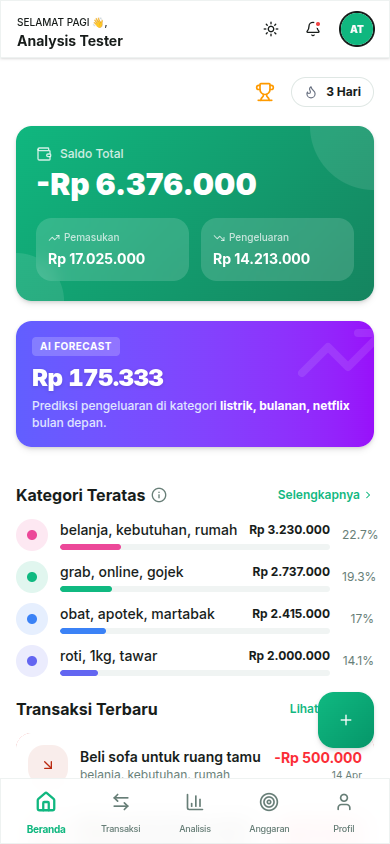
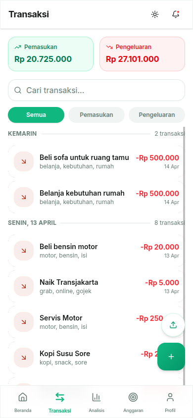
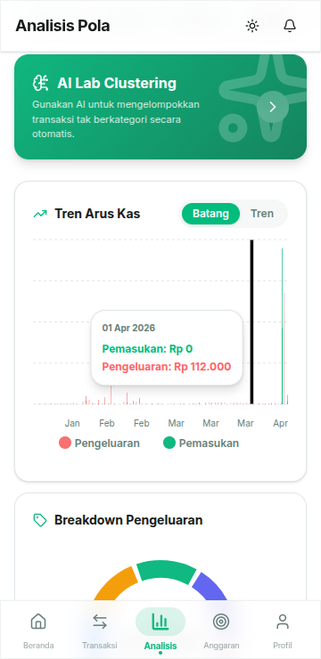
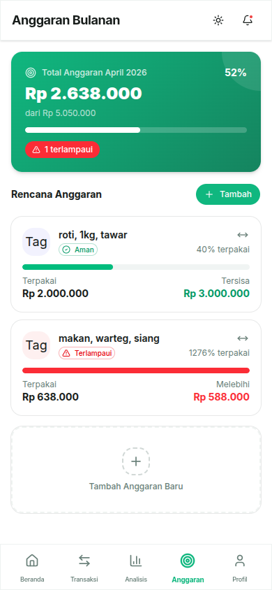
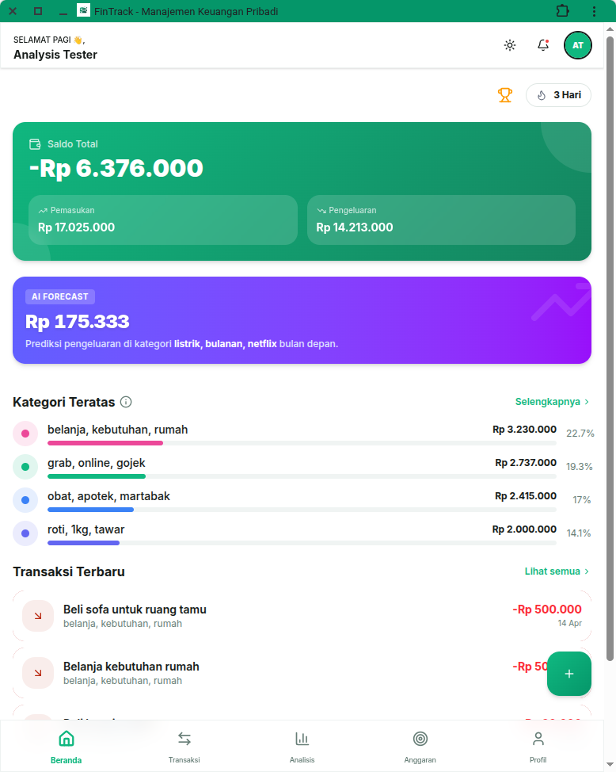

<!-- prettier-ignore -->
<div align="center">


# FinTrack

**Personal finance management with AI-powered transaction clustering**


[Overview](#overview) • [Architecture](#architecture) • [Features](#features) • [Getting Started](#getting-started) • [Project Structure](#project-structure)

</div>

---

## Overview

Financy is a full-stack personal finance application that helps users track income and expenses, set budgets, and visualize spending patterns. It integrates a machine learning microservice that automatically categorizes transactions using multilingual text embeddings and logistic regression, eliminating the need for manual tagging.

The system is built as three independent services orchestrated with Docker Compose: a **Next.js PWA** frontend, an **Express.js** backend API, and a **FastAPI** ML clustering service.

<div align="center">
  
  &nbsp;&nbsp;
  
  &nbsp;&nbsp;
  
</div>

## Architecture

```
┌──────────────────────┐
│  fintrack (PWA)      │  Next.js 16 · React 19 · Tailwind CSS
│  :3000               │  TanStack Query · Zustand · shadcn/ui
└──────────┬───────────┘
           │ REST
           ▼
┌──────────────────────┐
│  backend (API)       │  Express.js 5 · Prisma · PostgreSQL
│  :6789               │  BullMQ · Redis · JWT Auth
└──────────┬───────────┘
           │ REST
           ▼
┌──────────────────────┐
│  clustering (ML)     │  FastAPI · PyTorch · Sentence Transformers
│  :8000               │  multilingual-e5-large · scikit-learn
└──────────────────────┘
```

> [!NOTE]
> The frontend is not included in Docker Compose — it runs separately during development via `npm run dev`. Only the backend API, ML clustering service, and Redis are containerized.

## Features

### Transaction Management

- Record income and expenses manually or via CSV import
- Voice input through the Web Speech API for quick entry
- Infinite-scroll virtualized list with search and type filters

### AI Auto-Categorization

- Predicts spending categories using `intfloat/multilingual-e5-large` (1024-dim embeddings)
- Logistic Regression classifier trained on ~6,930 Indonesian transaction descriptions
- Confidence threshold (default 0.50) flags low-certainty predictions for manual review
- In-memory cache up to 50,000 entries for fast re-classification

### Budgeting

- Set per-category budgets with weekly, monthly, or yearly periods
- Automatic notifications at 80% (warning) and 100% (exceeded) thresholds

### Forecasting

- Monthly spending predictions per category using Simple Moving Average (SMA-3)

### Gamification

- XP and level system with daily streaks
- Achievement badges and weekly challenges to encourage consistent tracking

### Recurring Expenses

- Schedule fixed monthly expenses on any day of the month
- Cron job processes due items at midnight WIB, creating pending transactions

### Export

- Transaction reports in CSV, XLSX, or PDF with Indonesian Rupiah formatting

### PWA & Offline Support

- Installable on Android and iOS with home screen shortcuts
- Offline-first via IndexedDB mutation queue with automatic sync on reconnect
- Push notifications through Web Push (VAPID)

### Internationalization

- Indonesian and English UI via `next-intl`

<div align="center">
  
  &nbsp;&nbsp;
  
</div>

## Getting Started

### Prerequisites

- [Bun](https://bun.sh/) (backend runtime)
- [Node.js](https://nodejs.org/) v18+ (frontend)
- [Python](https://python.org/) 3.10+ (clustering service)
- [PostgreSQL](https://postgresql.org/)
- [Redis](https://redis.io/)
- [Docker](https://docker.com/) (optional, for containerized deployment)

### Quick Start with Docker Compose

Docker Compose runs the backend API, ML clustering service, and Redis. The frontend runs separately.

```bash
# Clone the repository
git clone https://github.com/<your-username>/financy-project.git
cd financy-project

# Create environment files
cp backend/.env.example backend/.env
# Edit backend/.env with your database URL, JWT secret, etc.

# Start backend + ML + Redis
docker compose up --build
```

The services will be available at:

| Service     | URL                     |
| ----------- | ----------------------- |
| Backend API | `http://localhost:6789` |
| ML Service  | `http://localhost:8001` |
| Redis       | `localhost:6379`        |

Then in a separate terminal, start the frontend:

```bash
cd fintrack
npm install
npm run dev
```

Open `http://localhost:3000` in your browser.

### Manual Development

Run all three services independently:

<details>
<summary><strong>Backend (Express.js)</strong></summary>

```bash
cd backend
bun install
bunx prisma generate
bunx prisma migrate dev
bun run db:seed
bun run dev
```

</details>

<details>
<summary><strong>Frontend (Next.js)</strong></summary>

```bash
cd fintrack
npm install
npm run dev
```

</details>

<details>
<summary><strong>ML Clustering (FastAPI)</strong></summary>

```bash
cd clustering
python -m venv venv
source venv/bin/activate
pip install -r requirements.txt
python main.py
```

</details>

> [!IMPORTANT]
> The backend requires a running PostgreSQL instance and Redis. Make sure `DATABASE_URL` and `REDIS_HOST` are configured in `backend/.env` before starting.

### Environment Variables

**Backend** (`backend/.env`):

| Variable         | Description                  | Default                 |
| ---------------- | ---------------------------- | ----------------------- |
| `DATABASE_URL`   | PostgreSQL connection string | —                       |
| `JWT_SECRET`     | JWT signing key              | —                       |
| `ML_SERVICE_URL` | Clustering service URL       | `http://localhost:8000` |
| `CLIENT_URL`     | Frontend URL (CORS)          | `http://localhost:3000` |
| `REDIS_HOST`     | Redis host                   | `localhost`             |
| `REDIS_PORT`     | Redis port                   | `6379`                  |
| `REDIS_PASSWORD` | Redis password               | —                       |

**Frontend** (`fintrack/.env`):

| Variable              | Description          | Default                        |
| --------------------- | -------------------- | ------------------------------ |
| `NEXT_PUBLIC_API_URL` | Backend API base URL | `http://localhost:6789/api/v1` |

## Project Structure

```
financy-project/
├── fintrack/                  #   Frontend PWA (Next.js)
│   ├── app/                   #   App Router pages & layouts
│   ├── components/            #   UI components (shadcn/ui, layout)
│   ├── hooks/                 #   15 custom React hooks
│   ├── lib/                   #   API client, Zustand store, locales
│   └── public/                #   Static assets, icons, screenshots
├── backend/                   #   Backend API (Express.js)
│   ├── src/
│   │   ├── controller/        #   HTTP handlers
│   │   ├── service/           #   Business logic
│   │   ├── repositories/      #   Data access (Prisma)
│   │   ├── routes/            #   API route definitions
│   │   ├── middleware/        #   Auth, errors, rate limiting
│   │   ├── queue/             #   BullMQ queue definitions
│   │   ├── worker/            #   Background job workers
│   │   └── schemas/           #   Zod validation schemas
│   ├── prisma/                #   Database schema & migrations
│   └── tests/                 #   Integration tests
├── clustering/                #   ML Service (FastAPI)
│   ├── main.py                #   FastAPI entry point
│   ├── clustering.py          #   Classifier service
│   └── data/                  #   Training data & model artifacts
└── docker-compose.yml         #   Production orchestration
```

## API Reference

All endpoints are prefixed with `/api/v1`. Most require JWT authentication.

| Method | Endpoint                   | Description                           |
| ------ | -------------------------- | ------------------------------------- |
| `POST` | `/auth/register`           | Register a new account                |
| `POST` | `/auth/login`              | Log in                                |
| `GET`  | `/auth/google/`            | Google OAuth flow                     |
| `GET`  | `/transactions/`           | List transactions (cursor pagination) |
| `POST` | `/transactions/`           | Create transaction (auto-categorized) |
| `POST` | `/transactions/import-csv` | Import from CSV                       |
| `POST` | `/analysis/run-v2`         | Run ML clustering analysis            |
| `POST` | `/analysis/confirm`        | Confirm cluster-to-category mappings  |
| `GET`  | `/dashboard/`              | Dashboard summary (cached)            |
| `GET`  | `/budgets/`                | List budgets with spending progress   |
| `GET`  | `/export/`                 | Export transactions (CSV/XLSX/PDF)    |
| `GET`  | `/gamification/stats`      | XP, level, and streak stats           |

See `backend/src/routes/` for the complete endpoint list.

## Background Jobs

The backend uses BullMQ with Redis for asynchronous processing:

| Worker                     | Responsibility                           |
| -------------------------- | ---------------------------------------- |
| `gamification-worker`      | XP calculation, level-ups, badge unlocks |
| `reminder-budget-worker`   | Budget threshold notifications           |
| `streak-worker`            | Daily streak tracking and resets         |
| `scheduled-expense-worker` | Recurring expense creation               |

Two cron jobs run on schedule:

- **Streak warning** — daily at 20:00 WIB, notifies users who haven't logged a transaction
- **Scheduled expense check** — daily at midnight WIB, processes due recurring items

## Database

15 Prisma models across five domains:

| Domain        | Models                                                                  |
| ------------- | ----------------------------------------------------------------------- |
| Users & Auth  | `User`, `UserSetting`                                                   |
| Finance       | `Transaction`, `Category`, `BudgetGoal`, `ScheduledExpense`, `Forecast` |
| ML Analysis   | `AnalysisRun`, `Cluster`                                                |
| Gamification  | `UserStats`, `Badge`, `UserBadge`, `Challenge`, `UserChallenge`         |
| Notifications | `Notification`, `PushSubscription`                                      |

## Training the ML Model

The clustering service uses a pre-trained model stored as `classifier_model_v2.joblib`. To retrain:

```bash
jupyter notebook train_script_2.ipynb
```

The training pipeline:

1. Loads ~6,930 labeled Indonesian transaction descriptions
2. Generates embeddings with `intfloat/multilingual-e5-large`
3. Tunes a Logistic Regression classifier via `GridSearchCV`
4. Exports the best model as a joblib file

> [!TIP]
> After retraining, place the new `classifier_model_v2.joblib` in `clustering/` and restart the service.

## Deployment

### Docker Compose (Production)

```bash
export DATABASE_URL="postgresql://..."
export JWT_SECRET="..."
export REDIS_PASSWORD="..."
export CLIENT_URL="https://fintrack.pitok.my.id"
export ALLOWED_ORIGINS="https://fintrack.pitok.my.id"

docker compose up -d --build
```

### Vercel (Backend)

The backend includes `api/index.js` for Vercel serverless deployment. Set the environment variables in the Vercel dashboard and deploy.
